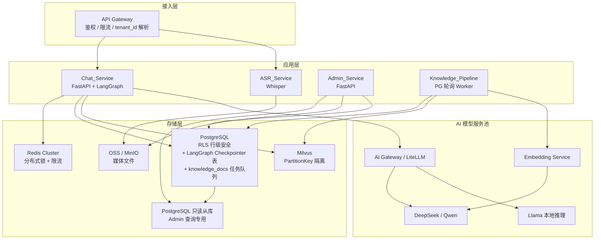
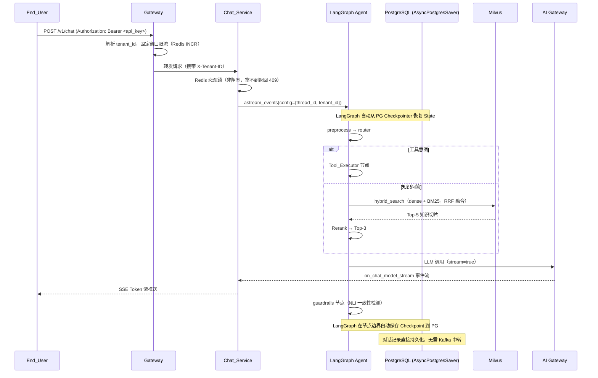
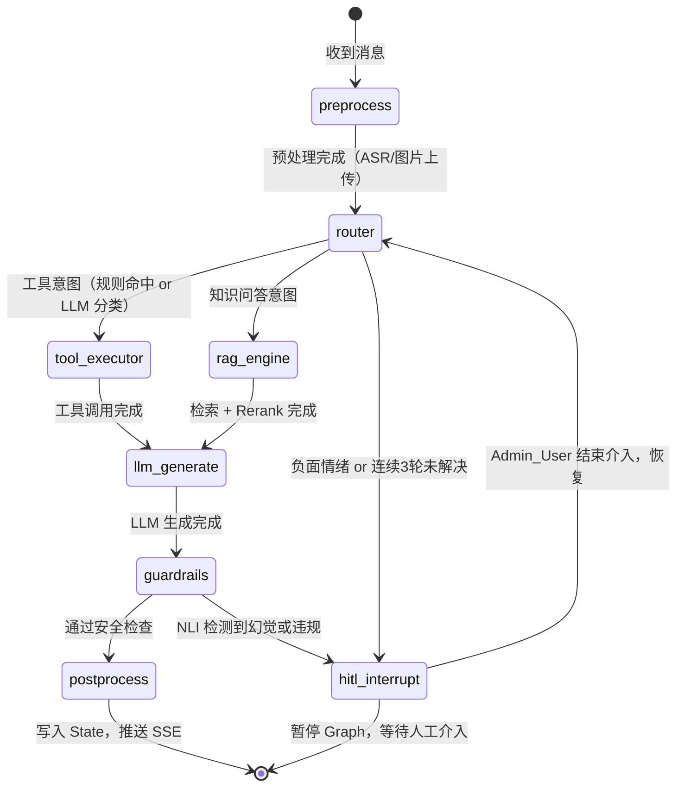
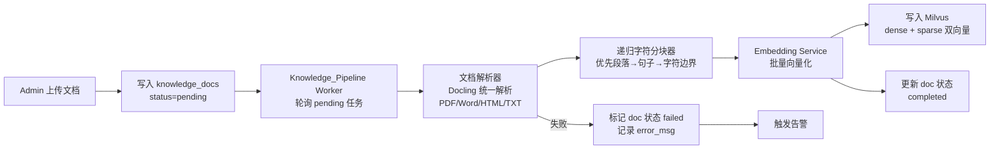
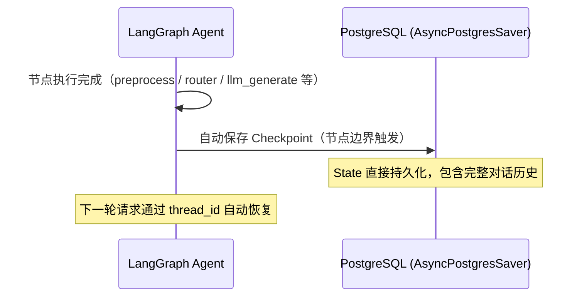
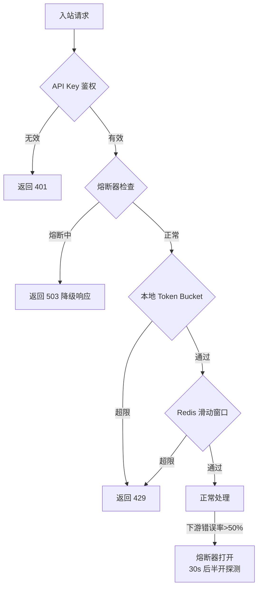

# Cuckoo-Echo 技术设计文档

## 概述

Cuckoo-Echo（布谷回响）是一个面向企业的百万日活 AI 智能客服 SaaS 平台。系统以多租户隔离为核心约束，通过 LangGraph 编排 Agent 工作流，结合 RAG 知识库检索、业务工具调用和多模态输入处理，为 B 端企业提供高并发、低延迟的智能客服能力。

### 设计目标

- 支持百万 DAU，单租户峰值 QPS ≥ 1000
- TTFT 分级 SLA：纯文本 <500ms / RAG <1200ms / 多模态 <3000ms
- 多租户数据强隔离（PostgreSQL RLS + Milvus PartitionKey + Redis Key 前缀）
- 无状态服务层，支持 Kubernetes HPA 水平扩缩容
- RPO <15min，RTO <4h

> **架构原则**：最小可用优先。MVP 阶段单区域部署，多地区扩展作为 Phase 2。不引入 DDD——客服 SaaS 的核心复杂度在 AI 编排和多租户隔离，不在业务领域建模，过度分层只会增加认知负担。

### 技术栈选型

| 层次 | 技术 | 选型理由 |
|------|------|----------|
| 接入层 | FastAPI + SSE/WebSocket | 原生异步，SSE 天然适合 Token 流推送 |
| ASGI 服务器 | Granian | Rust 实现的 ASGI/RSGI 服务器，比 uvicorn 吞吐高 2-4 倍；原生支持 HTTP/2；适合 SSE 长连接高并发场景；uvicorn 作为开发环境备选 |
| 数据校验 / 配置 | Pydantic v2 + pydantic-settings | Rust 核心，校验速度比 v1 快 5-50 倍；`pydantic-settings` 统一管理环境变量、`.env` 文件、Secrets，替代散落的 `os.environ.get()`；所有服务配置通过 `Settings(BaseSettings)` 类型安全加载 |
| 结构化日志 | structlog | 结构化 JSON 日志输出，天然适配 ELK/Datadog/Langfuse；支持 context binding（自动注入 tenant_id、thread_id）；比 loguru 更适合生产级可观测性管道 |
| JSON 序列化 | orjson | Rust 实现，序列化速度比标准 `json` 快 10 倍；SSE 高频 Token 推送场景收益明显；原生支持 `datetime`、`UUID`、`dataclass` 序列化 |
| Agent 编排 | LangGraph StateGraph | 支持 HITL 断点、Checkpointer、条件路由 |
| LangGraph Checkpointer | PostgreSQL AsyncPostgresSaver | 官方推荐，节点边界自动保存，State 直接持久化到 PG，无需额外 Redis 双写；Redis 仅用于分布式锁和限流 |
| 分布式锁 / 限流 | Redis Cluster | 悲观锁防并发脏写，固定窗口限流 |
| 持久化数据库 | PostgreSQL + RLS | 行级安全天然支持多租户隔离；Checkpointer 表与业务表共库，减少连接管理复杂度 |
| 向量数据库 | Milvus 2.5+ | PartitionKey 多租户隔离，内置 BM25 稀疏向量，原生支持混合检索，无需额外 Elasticsearch |
| 消息队列 | PostgreSQL（knowledge_docs 表轮询） | MVP 阶段文档上传频率低（运营手动操作），PG 表轮询 + LISTEN/NOTIFY 完全够用，省去 Kafka 的运维复杂度；Kafka 作为 Phase 2 扩展点，在文档处理量超过 PG 轮询瓶颈时引入 |
| 对象存储 | OSS/MinIO | 媒体文件存储，生成带签名 URL |
| LLM 网关 | LiteLLM / AI Gateway | OpenAI Compatible，统一多模型路由 |
| LLM 可观测性 | Langfuse（开源自托管） | LLM trace/span/评估，支持 OpenTelemetry，可私有化部署满足数据合规 |
| ASR | Whisper | 开源，支持私有化部署 |
| 文档解析 | Docling（IBM 开源） | 统一解析 PDF/Word/HTML/Markdown/图片，替代 pypdf + python-docx + BeautifulSoup 三件套；内置 OCR 和表格提取；MIT 许可，本地运行无需外部 API；RAG 场景专用，输出结构化 Markdown 保留文档层级 |
| Reranker | BGE Reranker v2（BAAI/bge-reranker-v2-m3） | 多语言 Cross-Encoder，中文效果远优于通用 NLI 模型；支持 8192 token 长输入；FlagEmbedding 库直接加载，推理延迟 <100ms |
| 包管理 | uv | Rust 实现，比 pip 快 10-100 倍；原生支持 `pyproject.toml`、lockfile（`uv.lock`）、虚拟环境管理；替代 pip + pip-tools + virtualenv 三件套，单一工具覆盖依赖解析、安装、锁定全流程 |
| 容器编排 | Kubernetes + HPA | 无状态服务弹性伸缩 |

> **关于包管理工具的选择**：项目统一使用 [uv](https://docs.astral.sh/uv/) 作为包管理工具，不使用 pip。uv 由 Astral（Ruff 团队）开发，Rust 实现，依赖解析和安装速度比 pip 快 10-100 倍。核心优势：(1) 原生支持 `pyproject.toml`，无需 `setup.py` 或 `requirements.txt`；(2) 自动生成 `uv.lock` 锁文件，确保跨环境可复现构建；(3) 内置虚拟环境管理（`uv venv`），替代 `python -m venv`；(4) 支持 `uv run` 直接在虚拟环境中执行命令，无需手动 `source activate`。所有开发者和 CI/CD 环境统一使用 `uv sync` 安装依赖，`uv run pytest` 运行测试。Docker 镜像构建中同样使用 `uv pip install` 替代 `pip install`。
>
> **安装 uv**：`curl -LsSf https://astral.sh/uv/install.sh | sh`（macOS/Linux）或 `brew install uv`（Homebrew）。

> **关于 Granian vs uvicorn**：Granian 是 Rust 实现的 ASGI 服务器，在 SSE 长连接和高并发场景下吞吐量显著优于 uvicorn。百万 DAU 的客服平台每个对话都是一个 SSE 长连接，Granian 的 Rust 事件循环在连接管理上开销更低。开发环境可继续使用 uvicorn（热重载更方便），生产环境切换为 `granian --interface asgi`。
>
> **关于 structlog**：客服 SaaS 的日志需要在每条日志中自动携带 `tenant_id`、`thread_id`、`user_id` 等上下文字段，structlog 的 context binding 天然支持这一需求。配合 `structlog.processors.JSONRenderer()` 输出 JSON 格式，可直接被 Datadog/ELK 索引，无需额外的日志解析规则。所有服务统一使用 `structlog.get_logger()` 替代 `logging.getLogger()`。
>
> **关于 Docling 替代 pypdf + python-docx + BeautifulSoup**：原设计用三个独立库分别处理 PDF/Word/HTML，每个库的输出格式不同，需要额外的适配层。Docling（IBM 开源，MIT 许可）提供统一的 `DocumentConverter` 接口，一次调用处理所有格式，输出结构化 `DoclingDocument` 对象，可直接导出为 Markdown（保留标题层级、表格、列表）。内置 OCR 引擎（EasyOCR），扫描件 PDF 也能处理。对 RAG 场景的分块质量显著优于纯文本提取。
>
> **关于 BGE Reranker v2 替代通用 CrossEncoder**：原设计的 Reranker 未指定具体模型。BGE Reranker v2（`BAAI/bge-reranker-v2-m3`）是目前中文 + 多语言 Rerank 效果最好的开源模型之一，在 BEIR 和 MIRACL 基准上达到 SOTA。支持 8192 token 长输入（覆盖长文档切片），通过 `FlagEmbedding` 库加载，推理延迟 <100ms，满足 Rerank 0.5s 超时要求。

> **关于 Kafka 的取舍**：原设计用 Kafka 做知识管道的事件分发，但 MVP 阶段文档上传是运营人员手动操作，频率极低（每天几十次），完全不需要 Kafka 的高吞吐能力。用 PostgreSQL 的 `knowledge_docs` 表 + 后台 worker 轮询（或 `LISTEN/NOTIFY`）即可实现异步处理，省去 Kafka 集群的部署和运维成本。Kafka 作为 Phase 2 扩展点，在文档处理量真正超过 PG 轮询瓶颈时再引入。


---

## 架构

### 系统整体架构图

> **MVP 单区域部署**：多地区 GSLB + 边缘/中心双区域架构作为 Phase 2，MVP 阶段单区域即可满足需求，避免过早引入分布式复杂度。



### 请求处理主流程




---

## 组件与接口

### 1. API Gateway

职责：多租户鉴权、限流、请求路由、媒体格式校验。

```python
# 核心中间件伪代码
class TenantAuthMiddleware:
    async def __call__(self, request: Request, call_next):
        api_key = request.headers.get("Authorization", "").removeprefix("Bearer ")
        if not api_key:
            return JSONResponse(status_code=401, content={"error": "Unauthorized"})
        # API Key 安全查找：数据库存储 SHA-256 哈希，不存明文
        # SHA-256 用于 API Key 查找是安全的（key 足够长，无需 bcrypt 的慢哈希）
        key_hash = hashlib.sha256(api_key.encode()).hexdigest()
        tenant = await tenant_repo.get_by_key_hash(key_hash)
        if not tenant:
            return JSONResponse(status_code=401, content={"error": "Unauthorized"})
        request.state.tenant_id = tenant.id
        return await call_next(request)

class RateLimitMiddleware:
    async def __call__(self, request: Request, call_next):
        tenant_id = request.state.tenant_id
        user_id = request.state.user_id
        # 固定窗口限流（Redis INCR + TTL）：比滑动窗口简单 10 倍，在百万 QPS 下
        # 滑动窗口的 Sorted Set 操作成本过高，固定窗口已足够 SaaS 场景
        key = f"cuckoo:ratelimit:{tenant_id}:{user_id}"
        count = await redis.incr(key)
        if count == 1:
            await redis.expire(key, 1)  # 1 秒窗口
        limit = await get_tenant_rate_limit(tenant_id)  # 默认 10 RPS/user
        if count > limit:
            return JSONResponse(status_code=429, headers={"Retry-After": "1"})
        return await call_next(request)
```

**核心接口：**

| 方法 | 路径 | 说明 |
|------|------|------|
| POST | `/v1/chat/completions` | 对话（SSE 流式） |
| POST | `/v1/chat/ws` | WebSocket 对话 |
| POST | `/v1/media/upload` | 媒体文件上传（音频/图片） |
| GET  | `/v1/threads/{thread_id}` | 获取会话历史 |

### 2. Chat_Service

职责：接收对话请求，通过分布式锁保证 Thread 串行处理，驱动 LangGraph Agent，推送 SSE 流。

> **并发控制策略**：采用"悲观锁 + 快速失败"。C 端聊天场景中用户极少在 AI 回复完成前连发多条消息，直接用 Redis 分布式锁保护 Thread 状态机，拿不到锁立即返回 409，让前端 UI 提示"AI 正在思考中"。这比维护 per-thread 队列简单得多，且消除了队列消息丢失风险。
>
> **锁作用域的关键陷阱**：`async with redis_lock(...):` 的 context manager 在 `return EventSourceResponse(event_generator())` 时就退出了——FastAPI 返回 Response 对象时，generator 还没有开始执行，锁已经被释放。必须将锁的获取和释放放在 generator 内部，而非 endpoint 函数的 context manager 中。

```python
THREAD_LOCK_KEY = "cuckoo:lock:{thread_id}"
LOCK_TTL        = 90  # 秒，覆盖最长 LLM 生成时间

@router.post("/v1/chat/completions")
async def chat_completions(req: ChatRequest, tenant_id: str = Depends(get_tenant)):
    lock_key = THREAD_LOCK_KEY.format(thread_id=req.thread_id)
    config = {"configurable": {"thread_id": req.thread_id, "tenant_id": tenant_id}}

    async def event_generator():
        # 锁必须在 generator 内部获取和释放，而非 endpoint 的 context manager
        # 原因：return EventSourceResponse(generator) 时 generator 尚未执行，
        # endpoint 的 context manager 已退出，锁已释放，保护无效
        lock = redis.lock(lock_key, timeout=LOCK_TTL)
        acquired = await lock.acquire(blocking=False)
        if not acquired:
            # 通过 SSE 推送 409 语义的错误事件，而非抛出 HTTPException
            yield f"data: {json.dumps({'error': 'CONCURRENT_REQUEST', 'message': 'AI is still processing'})}\n\n"
            return

        tokens_used = 0
        try:
            async for chunk in asyncio.shield(agent.astream_events(
                req.payload,
                config=config,
                version="v2",
            )):
                if chunk["event"] == "on_chat_model_stream":
                    token = chunk["data"]["chunk"].content
                    if token:
                        yield f"data: {orjson.dumps({'content': token}).decode()}\n\n"
                elif chunk["event"] == "on_llm_end":
                    usage = chunk["data"].get("output", {}).get("usage_metadata", {})
                    tokens_used = usage.get("input_tokens", 0) + usage.get("output_tokens", 0)
            yield "data: [DONE]\n\n"
        except asyncio.CancelledError:
            logger.warning("client_disconnected", thread_id=req.thread_id)
            raise
        finally:
            await lock.release()
            # 计费统计：通过 Langfuse callback 或 UsageMetadataCallbackHandler 收集
            # 比在 finally 块里做 UPDATE 更可靠（避免 generator 被 GC 前连接已归还）
            if tokens_used > 0:
                await billing_service.record_usage(req.thread_id, tenant_id, tokens_used)

    return EventSourceResponse(event_generator(), ping=15)
```

### 3. LangGraph Agent 状态图



**StateGraph 节点定义：**

> **LangGraph 最佳实践**：在 Web 框架中，应创建**单个全局 graph 对象**并在应用启动时初始化，而非每次请求创建新实例。Checkpointer 也应全局共享，通过 `config={"configurable": {"thread_id": thread_id}}` 在调用时区分会话。多次创建 graph 会导致内存泄漏和 Checkpointer 连接池耗尽。
>
> **摘要压缩策略**：不在每轮入口处无条件检查消息数量（浪费一次节点执行），而是在 `preprocess` 节点内用条件判断，仅在超过阈值时触发摘要，避免不必要的 LLM 调用开销。

```python
from langgraph.graph import StateGraph, END
from typing import TypedDict, Annotated
from langgraph.checkpoint.postgres.aio import AsyncPostgresSaver

class AgentState(TypedDict):
    thread_id: str
    tenant_id: str
    user_id: str
    messages: list[dict]          # 对话历史（超过阈值时被摘要压缩）
    summary: str | None           # 历史摘要（替代过长的 messages）
    user_intent: str | None       # 路由结果
    rag_context: list[str]        # RAG 检索切片
    tool_calls: list[dict]        # 工具调用记录
    media_urls: list[str]         # 媒体文件 URL
    hitl_requested: bool          # 是否请求人工介入
    tokens_used: int              # 本轮 Token 消耗
    llm_response: str             # LLM 生成的回复（guardrails 检测用）
    guardrails_passed: bool       # guardrails 检测结果
    correction_message: str | None  # guardrails 检测失败时的纠正消息（通过 SSE 推送）

SUMMARIZE_THRESHOLD = 50  # 消息轮数超过此值时触发摘要压缩

async def preprocess_node(state: AgentState) -> AgentState:
    """预处理：ASR/图片上传，以及按需触发摘要压缩（避免每轮无条件检查）"""
    # 摘要压缩：仅在超过阈值时触发，不单独占用一个节点
    if len(state["messages"]) >= SUMMARIZE_THRESHOLD:
        summary = await llm.summarize(state["messages"])
        state = {**state, "messages": [], "summary": summary}
    # ... 其余预处理逻辑（ASR、图片 URL 获取等）
    return state

def build_agent_graph(checkpointer: AsyncPostgresSaver) -> StateGraph:
    graph = StateGraph(AgentState)
    graph.add_node("preprocess", preprocess_node)  # 含摘要压缩逻辑
    graph.add_node("router", router_node)
    graph.add_node("rag_engine", rag_engine_node)
    graph.add_node("tool_executor", tool_executor_node)
    graph.add_node("llm_generate", llm_generate_node)
    graph.add_node("guardrails", guardrails_node)
    graph.add_node("postprocess", postprocess_node)

    graph.set_entry_point("preprocess")
    graph.add_edge("preprocess", "router")
    graph.add_conditional_edges("router", route_decision, {
        "tool": "tool_executor",
        "rag": "rag_engine",
        "hitl": END,  # HITL 断点，暂停 Graph
    })
    graph.add_edge("tool_executor", "llm_generate")
    graph.add_edge("rag_engine", "llm_generate")
    graph.add_edge("llm_generate", "guardrails")
    graph.add_conditional_edges("guardrails", guardrails_decision, {
        "pass": "postprocess",
        "hitl": END,  # 检测到幻觉或违规，转人工
    })
    graph.add_edge("postprocess", END)

    return graph.compile(checkpointer=checkpointer, interrupt_before=["hitl"])
```

> **postprocess 节点职责**：(1) 如果 `correction_message` 非空（guardrails 检测失败），通过 SSE 推送纠正消息；(2) 将本轮消息追加到 `messages` 列表（供下轮对话使用）；(3) 更新 `unresolved_turns` 计数（用于 HITL 触发判断）。SSE 推送本身由 `event_generator` 中的 `on_chat_model_stream` 事件处理，`postprocess` 只负责推送纠正消息和状态更新。

### 4. Router 节点（规则引擎 + LLM 兜底）

```python
RULE_PATTERNS = {
    "get_order_status": [r"查.{0,5}订单", r"order\s*status", r"我的订单"],
    "update_shipping_address": [r"改.{0,5}地址", r"修改.{0,5}收货", r"change.*address"],
}

async def router_node(state: AgentState) -> AgentState:
    text = state["messages"][-1]["content"]
    # 1. 规则引擎优先（确定性路由，准确率 ≥ 99.9%）
    for tool_name, patterns in RULE_PATTERNS.items():
        if any(re.search(p, text, re.IGNORECASE) for p in patterns):
            return {**state, "user_intent": f"tool:{tool_name}"}
    # 2. 情绪检测（负面情绪 or 连续未解决 → HITL）
    if detect_negative_sentiment(state) or state.get("unresolved_turns", 0) >= 3:
        return {**state, "hitl_requested": True, "user_intent": "hitl"}
    # 3. LLM 兜底分类
    intent = await llm_classify_intent(text, state["tenant_id"])
    return {**state, "user_intent": intent}
```

### 5. RAG Engine（混合检索）

> **实现说明**：利用 Milvus 2.5+ 的 `hybrid_search` API，dense 向量检索和 BM25 稀疏向量检索在同一次请求中完成，Milvus 内部执行 RRF 融合，无需应用层手动合并两路结果。

```python
from pymilvus import AnnSearchRequest, RRFRanker

async def rag_engine_node(state: AgentState) -> AgentState:
    query = state["messages"][-1]["content"]
    tenant_id = state["tenant_id"]

    # 向量化查询（dense）
    query_vec = await embedding_service.embed(query)

    # 混合检索：dense + BM25 sparse，由 Milvus 内部 RRF 融合
    # 注意：RRF 得分为 1/(k+rank) 量级（约 0.01~0.05），不是余弦相似度的 0~1 分布
    # 因此阈值过滤必须在检索前（通过 expr 参数），而非对 RRF 得分做绝对值过滤
    dense_req = AnnSearchRequest(
        data=[query_vec],
        anns_field="dense_vector",
        param={"metric_type": "COSINE", "params": {"ef": 100}},
        limit=10,
        expr=f"tenant_id == '{tenant_id}'",  # 融合前过滤，确保租户隔离
    )
    sparse_req = AnnSearchRequest(
        data=[query],          # BM25 直接接受原始文本
        anns_field="sparse_vector",
        param={"metric_type": "BM25"},
        limit=10,
        expr=f"tenant_id == '{tenant_id}'",
    )

    results = collection.hybrid_search(
        reqs=[dense_req, sparse_req],
        rerank=RRFRanker(k=60),  # RRF k 参数，通常取 60
        limit=5,
        output_fields=["chunk_text", "doc_id"],
        partition_names=[tenant_id],  # 双重隔离保障
    )

    if not results or not results[0]:
        return {**state, "rag_context": [], "user_intent": "no_answer"}

    # 软删除过滤：排除已标记删除的文档
    doc_ids = [r.entity.get("doc_id") for r in results[0]]
    active_docs = await get_active_doc_ids(doc_ids, tenant_id)  # 查 PG deleted_at IS NULL
    chunks = [r.entity.get("chunk_text") for r in results[0]
              if r.entity.get("doc_id") in active_docs]

    if not chunks:
        return {**state, "rag_context": [], "user_intent": "no_answer"}

    # 始终执行 Rerank（带超时保护）
    # 注意：不要用 RRF 原始分数做阈值跳过 Rerank——RRF 得分受索引类型和数据分布影响，
    # 0.85 这类绝对阈值在不同知识库下毫无意义，跳过 Rerank 会导致回答质量不稳定
    try:
        reranked = await asyncio.wait_for(
            reranker.rerank(query, chunks),
            timeout=0.5,
        )
        top3 = reranked[:3]
    except asyncio.TimeoutError:
        # Rerank 超时降级：直接取 RRF Top-3，不阻断主流程
        logger.warning("rerank_timeout", query_len=len(query), tenant_id=tenant_id)
        top3 = chunks[:3]

    return {**state, "rag_context": top3}
```

### 5.5 Guardrails 节点（幻觉检测 + 安全过滤）

客服场景的幻觉风险极高（Air Canada 案例：AI 幻觉出不存在的退款政策被法院判决赔偿）。

> **Guardrails 与 Streaming 的时序问题**：LangGraph 的 `on_chat_model_stream` 事件在 LLM 生成时实时触发，Token 已经通过 SSE 推送给用户。Guardrails 节点在 `llm_generate` 节点完成后才执行，此时无法撤回已发出的 Token。
>
> **正确的处理方式**：Guardrails 不拦截已发出的 Token，而是在检测到幻觉时：(1) 立即推送一条"纠正消息"覆盖前面的回答；(2) 触发 HITL，让人工客服介入并告知用户"刚才的回答可能有误"。这比静默失败或假装没发生要诚实得多，也是 Air Canada 案例的正确教训——问题不在于 AI 说错了，而在于没有纠错机制。
>
> **为什么不用 Embedding Cosine Similarity 检测幻觉**：这是学术界已证明有根本性局限的方法（arxiv 2512.15068）。Embedding 相似度衡量语义接近程度，而非事实一致性——"7天退货"和"14天退货"语义相似但事实相反。固定阈值（如 0.5）在不同知识库下误报率极高。
>
> **推荐方案：NLI（自然语言推理）一致性检测**。使用轻量级 NLI 模型（如 `cross-encoder/nli-deberta-v3-small`，推理延迟 <50ms）判断回答是否与检索上下文"蕴含"（entailment）。工具调用场景（有结构化数据支撑）跳过检测。注意：Reranker（BGE Reranker v2）和 NLI 模型职责不同——Reranker 负责检索结果排序，NLI 负责生成结果的事实一致性验证，两者不可互相替代。

```python
from sentence_transformers import CrossEncoder

nli_model = CrossEncoder("cross-encoder/nli-deberta-v3-small")
# 标签顺序：contradiction=0, entailment=1, neutral=2

async def guardrails_node(state: AgentState) -> AgentState:
    """
    NLI 幻觉检测：在 LLM 生成完成后验证回答是否与 RAG 上下文一致。
    注意：此时 Token 已通过 SSE 推送，检测失败时推送纠正消息而非撤回。
    仅在 RAG 场景下执行（工具调用结果有结构化数据支撑，无需检测）。
    """
    response = state.get("llm_response", "")
    rag_context = state.get("rag_context", [])

    # 非 RAG 场景（工具调用、闲聊）跳过检测
    if not rag_context:
        return {**state, "guardrails_passed": True}

    try:
        pairs = [(ctx, response) for ctx in rag_context]
        scores = await asyncio.wait_for(
            asyncio.get_event_loop().run_in_executor(
                None, lambda: nli_model.predict(pairs, apply_softmax=True)
            ),
            timeout=0.3,  # NLI 推理应在 50ms 内完成，300ms 为保守超时
        )
        # scores shape: (n_pairs, 3)，列顺序：contradiction, entailment, neutral
        max_entailment = max(s[1] for s in scores)  # entailment 列

        if max_entailment < 0.5:  # 无任何切片支撑回答
            logger.warning(
                "guardrails_hallucination_detected",
                thread_id=state["thread_id"],
                max_entailment=max_entailment,
            )
            # 注意：不能撤回已发出的 Token，推送纠正消息并触发 HITL
            correction = "⚠️ 抱歉，刚才的回答可能有误，已为您转接人工客服核实。"
            return {
                **state,
                "guardrails_passed": False,
                "correction_message": correction,  # postprocess 节点推送此消息
                "hitl_requested": True,
            }
    except asyncio.TimeoutError:
        # NLI 超时降级：放行，记录告警，不阻断主流程
        logger.warning("guardrails_nli_timeout", thread_id=state["thread_id"])

    return {**state, "guardrails_passed": True}

def guardrails_decision(state: AgentState) -> str:
    return "hitl" if state.get("hitl_requested") else "pass"
```




```python
class KnowledgePipelineWorker:
    """
    轮询 knowledge_docs 表中 status='pending' 的任务。
    MVP 阶段文档上传频率低，PG 轮询完全够用，无需 Kafka。
    Phase 2 如需高吞吐，可将此 Worker 替换为 Kafka Consumer，接口不变。
    """
    async def run(self):
        while True:
            # 使用 SELECT ... FOR UPDATE SKIP LOCKED 实现多 Worker 并发安全
            async with tenant_db_context(db_conn, SYSTEM_TENANT) as conn:
                row = await conn.fetchrow(
                    "SELECT id, tenant_id, oss_path FROM knowledge_docs "
                    "WHERE status = 'pending' ORDER BY created_at LIMIT 1 "
                    "FOR UPDATE SKIP LOCKED"
                )
            if row:
                await self.process_document(row["id"], row["tenant_id"], row["oss_path"])
            else:
                await asyncio.sleep(2)  # 无任务时等待 2 秒再轮询

    async def process_document(self, doc_id: str, tenant_id: str, file_path: str):
        try:
            await self._update_doc_status(doc_id, "processing")
            raw_text = await document_parser.parse(file_path)  # Docling DocumentConverter
            text_chunks = recursive_splitter.split(
                raw_text,
                separators=["\n\n", "\n", "。", "！", "？", ".", "!", "?", " ", ""],
                chunk_size=512,
                chunk_overlap=64,
            )
            dense_vectors = await embedding_service.embed_batch(text_chunks)
            await milvus_client.insert(
                collection="knowledge_chunks",
                data=[{
                    "id": str(uuid4()),
                    "tenant_id": tenant_id,
                    "doc_id": doc_id,
                    "chunk_text": t,
                    "dense_vector": v,
                    "created_at": int(time.time()),
                } for t, v in zip(text_chunks, dense_vectors)],
                partition_name=tenant_id,
            )
            await self._update_doc_status(doc_id, "completed", chunk_count=len(text_chunks))
        except Exception as e:
            logger.error("doc_processing_failed", doc_id=doc_id, error=str(e))
            await self._update_doc_status(doc_id, "failed", error_msg=str(e))
            # 触发告警（通过监控系统，而非 DLQ）
            metrics.increment("knowledge_pipeline.failed", tags={"tenant_id": tenant_id})
```

### 7. ASR_Service

```python
@app.post("/v1/asr/transcribe")
async def transcribe(file: UploadFile, tenant_id: str = Header(...)):
    # 格式校验（Gateway 已做，此处二次防御）
    if file.content_type not in SUPPORTED_AUDIO_TYPES:
        raise HTTPException(status_code=415)
    # 上传至 OSS
    oss_path = await oss_client.upload(file, prefix=f"{tenant_id}/audio/")
    # Whisper 转写
    try:
        text = await whisper_client.transcribe(oss_path)
        return {"text": text, "oss_path": oss_path}
    except WhisperError:
        raise HTTPException(status_code=500, detail="ASR_FAILED")
```


---

## 数据模型

### PostgreSQL Schema（DDL）

```sql
-- 启用 UUID 扩展
CREATE EXTENSION IF NOT EXISTS "pgcrypto";

-- 租户表（不启用 RLS，由应用层管理）
CREATE TABLE tenants (
    id              UUID PRIMARY KEY DEFAULT gen_random_uuid(),
    name            TEXT NOT NULL,
    -- API Key 安全存储：明文 key 仅在创建时返回一次，数据库只存哈希
    -- 格式：前缀 "ck_" + 随机 32 字节 base64url，便于日志中识别
    -- 查找时：SELECT * FROM tenants WHERE api_key_hash = sha256($1)
    api_key_prefix  TEXT NOT NULL,        -- 前 8 位明文，用于日志识别（如 "ck_abc123"）
    api_key_hash    TEXT NOT NULL UNIQUE, -- SHA-256(full_api_key)，用于查找
    status          TEXT NOT NULL DEFAULT 'active' CHECK (status IN ('active', 'suspended')),
    llm_config      JSONB NOT NULL DEFAULT '{}',  -- {"model": "deepseek-chat", "temperature": 0.7}
    rate_limit      JSONB NOT NULL DEFAULT '{"tenant_rps": 100, "user_rps": 10}',
    created_at      TIMESTAMPTZ NOT NULL DEFAULT NOW()
);
CREATE INDEX idx_tenants_api_key_hash ON tenants(api_key_hash);

-- 用户表
CREATE TABLE users (
    id           UUID PRIMARY KEY DEFAULT gen_random_uuid(),
    tenant_id    UUID NOT NULL REFERENCES tenants(id),
    external_uid TEXT NOT NULL,  -- 租户侧的用户 ID
    profile      JSONB NOT NULL DEFAULT '{}',
    created_at   TIMESTAMPTZ NOT NULL DEFAULT NOW(),
    UNIQUE (tenant_id, external_uid)
);
ALTER TABLE users ENABLE ROW LEVEL SECURITY;
CREATE POLICY users_tenant_isolation ON users
    USING (tenant_id = current_setting('app.current_tenant')::UUID);

-- 会话表
CREATE TABLE threads (
    id          UUID PRIMARY KEY DEFAULT gen_random_uuid(),
    tenant_id   UUID NOT NULL REFERENCES tenants(id),
    user_id     UUID NOT NULL REFERENCES users(id),
    title       TEXT,
    status      TEXT NOT NULL DEFAULT 'active'
                CHECK (status IN ('active', 'human_intervention', 'closed')),
    metadata    JSONB NOT NULL DEFAULT '{}',
    created_at  TIMESTAMPTZ NOT NULL DEFAULT NOW(),
    updated_at  TIMESTAMPTZ NOT NULL DEFAULT NOW()
);
ALTER TABLE threads ENABLE ROW LEVEL SECURITY;
CREATE POLICY threads_tenant_isolation ON threads
    USING (tenant_id = current_setting('app.current_tenant')::UUID);
CREATE INDEX idx_threads_tenant_user ON threads(tenant_id, user_id);

-- 消息表
CREATE TABLE messages (
    id           UUID PRIMARY KEY DEFAULT gen_random_uuid(),
    tenant_id    UUID NOT NULL REFERENCES tenants(id),
    thread_id    UUID NOT NULL REFERENCES threads(id),
    role         TEXT NOT NULL CHECK (role IN ('user', 'assistant', 'tool', 'system')),
    content      TEXT,
    media_urls   JSONB NOT NULL DEFAULT '[]',   -- [{"type": "image", "url": "oss://..."}]
    tool_calls   JSONB NOT NULL DEFAULT '[]',   -- [{"name": "get_order_status", "args": {}, "result": {}}]
    tokens_used  INTEGER NOT NULL DEFAULT 0,
    status       TEXT NOT NULL DEFAULT 'completed'
                 CHECK (status IN ('completed', 'interrupted', 'streaming')),
    created_at   TIMESTAMPTZ NOT NULL DEFAULT NOW()
);
ALTER TABLE messages ENABLE ROW LEVEL SECURITY;
CREATE POLICY messages_tenant_isolation ON messages
    USING (tenant_id = current_setting('app.current_tenant')::UUID);
CREATE INDEX idx_messages_thread ON messages(thread_id, created_at);
CREATE INDEX idx_messages_tenant ON messages(tenant_id, created_at);

-- 知识文档表（支持软删除，保留审计记录）
CREATE TABLE knowledge_docs (
    id          UUID PRIMARY KEY DEFAULT gen_random_uuid(),
    tenant_id   UUID NOT NULL REFERENCES tenants(id),
    filename    TEXT NOT NULL,
    oss_path    TEXT NOT NULL,
    status      TEXT NOT NULL DEFAULT 'pending'
                CHECK (status IN ('pending', 'processing', 'completed', 'failed')),
    chunk_count INTEGER,
    error_msg   TEXT,
    deleted_at  TIMESTAMPTZ,  -- 软删除时间戳，NULL 表示未删除
    created_at  TIMESTAMPTZ NOT NULL DEFAULT NOW(),
    updated_at  TIMESTAMPTZ NOT NULL DEFAULT NOW()
);
ALTER TABLE knowledge_docs ENABLE ROW LEVEL SECURITY;
CREATE POLICY knowledge_docs_tenant_isolation ON knowledge_docs
    USING (tenant_id = current_setting('app.current_tenant')::UUID);

-- 人工介入记录表
CREATE TABLE hitl_sessions (
    id           UUID PRIMARY KEY DEFAULT gen_random_uuid(),
    tenant_id    UUID NOT NULL REFERENCES tenants(id),
    thread_id    UUID NOT NULL REFERENCES threads(id),
    admin_user_id UUID,
    started_at   TIMESTAMPTZ NOT NULL DEFAULT NOW(),
    ended_at     TIMESTAMPTZ,
    status       TEXT NOT NULL DEFAULT 'pending'
                 CHECK (status IN ('pending', 'active', 'resolved', 'auto_escalated'))
);
ALTER TABLE hitl_sessions ENABLE ROW LEVEL SECURITY;
CREATE POLICY hitl_sessions_tenant_isolation ON hitl_sessions
    USING (tenant_id = current_setting('app.current_tenant')::UUID);

-- RLS 激活函数（每次事务开头调用）
-- 使用方式：SET LOCAL app.current_tenant = '<tenant_uuid>';
```

### RLS 激活模式

> **PgBouncer 兼容性**：`SET LOCAL` 是事务级变量，必须在同一个事务内执行。使用 PgBouncer 时，必须配置为 **transaction 模式**（`pool_mode = transaction`），这样每个事务都会获得独立的后端连接，`SET LOCAL` 在事务结束前始终有效。**不要使用 session 模式**——session 模式下连接被长期占用，在高并发场景下会耗尽连接池。asyncpg 直连（不经过 PgBouncer）也是可行方案，适合连接数可控的场景。
>
> **RLS 性能说明**：RLS 策略在每行扫描时执行，对于 `tenant_id = current_setting(...)::UUID` 这类简单等值条件，PostgreSQL 会将其下推为索引条件（Index Scan），性能开销极小。关键是确保 `tenant_id` 列上有索引（DDL 中已包含）。避免在 RLS 策略中使用子查询或函数调用，否则会退化为每行一次子查询，性能急剧下降。

```python
@asynccontextmanager
async def tenant_db_context(conn, tenant_id: str):
    """在事务内激活 RLS。
    
    要求：PgBouncer 必须使用 transaction 模式（pool_mode = transaction），
    确保同一事务内的所有 SQL 使用同一后端连接，SET LOCAL 不会跨连接失效。
    """
    async with conn.transaction():
        await conn.execute("SET LOCAL app.current_tenant = $1", tenant_id)
        yield conn
        # 事务结束后 SET LOCAL 自动失效，连接归还连接池
```

### Milvus Collection 配置

> **Milvus 2.5+ 内置混合检索**：Milvus 2.5 起原生支持 BM25 稀疏向量（`SPARSE_FLOAT_VECTOR`），可在同一 Collection 内同时存储 dense 向量和 sparse 向量，通过 `hybrid_search` API 一次请求完成混合检索，无需额外维护 Elasticsearch 集群，大幅降低运维复杂度。
>
> **中文分词配置**：使用 Milvus 2.5 内置的 `chinese` analyzer（`analyzer_params={"type": "chinese"}`），自动启用 jieba 分词 + 停用词过滤 + 标点移除，比手动配置 `{"tokenizer": "jieba"}` 更简洁且包含更完整的文本处理管道。对于多语言客服场景，Phase 2 可升级为 `language_identifier` analyzer，自动检测语言并应用对应的分词器。

```python
from pymilvus import CollectionSchema, FieldSchema, DataType, Collection, Function, FunctionType

# 单 Collection，同时支持 dense 向量检索 + BM25 稀疏向量检索
schema = CollectionSchema(fields=[
    FieldSchema("id",           DataType.VARCHAR, max_length=64, is_primary=True),
    FieldSchema("tenant_id",    DataType.VARCHAR, max_length=64, is_partition_key=True),
    FieldSchema("doc_id",       DataType.VARCHAR, max_length=64),
    FieldSchema("chunk_text",   DataType.VARCHAR, max_length=4096,
                enable_analyzer=True,
                analyzer_params={"type": "chinese"}),  # Milvus 2.5 内置 chinese analyzer，自动 jieba 分词 + 停用词过滤
    FieldSchema("dense_vector", DataType.FLOAT_VECTOR, dim=1536),
    FieldSchema("sparse_vector",DataType.SPARSE_FLOAT_VECTOR),  # BM25 稀疏向量
    FieldSchema("created_at",   DataType.INT64),
])

# 内置 BM25 函数：自动将 chunk_text 转换为 sparse_vector
bm25_function = Function(
    name="bm25",
    function_type=FunctionType.BM25,
    input_field_names=["chunk_text"],
    output_field_names=["sparse_vector"],
)
schema.add_function(bm25_function)

collection = Collection(name="knowledge_chunks", schema=schema, num_partitions=64)

# Dense 向量索引（HNSW）
collection.create_index("dense_vector", {
    "index_type": "HNSW",
    "metric_type": "COSINE",
    "params": {"M": 16, "efConstruction": 200},
})
# Sparse 向量索引（BM25 专用）
collection.create_index("sparse_vector", {
    "index_type": "SPARSE_INVERTED_INDEX",
    "metric_type": "BM25",
})
```

### Redis 数据结构

```
# Thread 并发锁（悲观锁 + 快速失败）
cuckoo:lock:{thread_id}    →  String（分布式锁，TTL 90s）

# 限流固定窗口
cuckoo:ratelimit:{tenant_id}:{user_id}  →  Integer（INCR 计数）
TTL: 1s（固定窗口，每秒自动重置）
```

> **语义缓存实现说明**：语义缓存不能用 `query_hash` 做 key——哈希是精确匹配，"退货政策"和"怎么退货"哈希不同但语义相同。正确实现是将查询向量化后在 Redis Vector Search（或 Milvus）中做相似度查找，命中阈值 ≥ 0.95 时返回缓存。MVP 阶段可以复用 Milvus 的 `semantic_cache` collection（独立于知识库），避免引入额外的 Redis Vector Search 模块。语义缓存是可选功能（需租户显式启用），不在 MVP 关键路径上。


---

## API 接口设计

### C 端对话接口

```
POST /v1/chat/completions
Authorization: Bearer <tenant_api_key>
Content-Type: application/json

Request:
{
  "thread_id": "uuid",          // 可选，不传则创建新会话
  "user_id": "external_uid",
  "messages": [
    {"role": "user", "content": "我的订单 12345 到哪了？"}
  ],
  "stream": true,
  "media": [                    // 可选，多模态
    {"type": "image", "oss_url": "oss://bucket/path/img.jpg"},
    {"type": "audio", "oss_url": "oss://bucket/path/audio.mp3"}
  ]
}

Response (SSE):
data: {"id":"msg_xxx","delta":{"content":"您好"},"finish_reason":null}
data: {"id":"msg_xxx","delta":{"content":"，您的订单"},"finish_reason":null}
data: [DONE]
```

### 媒体上传接口

```
POST /v1/media/upload
Authorization: Bearer <tenant_api_key>
Content-Type: multipart/form-data

Response:
{
  "oss_url": "oss://bucket/tenant_id/media/uuid.jpg",
  "signed_url": "https://oss.example.com/...",
  "type": "image"
}
```

### Admin 接口

```
# 文档管理
POST   /admin/v1/knowledge/docs          上传文档（max 50MB）
GET    /admin/v1/knowledge/docs/{id}     查询处理进度
DELETE /admin/v1/knowledge/docs/{id}     删除文档（60s 内清除向量）
POST   /admin/v1/knowledge/docs/{id}/retry  手动重试失败文档

# 租户配置
PUT    /admin/v1/config/persona          配置 System Prompt 和 Persona
PUT    /admin/v1/config/model            选择 LLM 模型
PUT    /admin/v1/config/rate-limit       自定义限流阈值

# 人工介入
GET    /admin/v1/hitl/queue              待处理介入请求列表
POST   /admin/v1/hitl/{session_id}/take  接管会话
POST   /admin/v1/hitl/{session_id}/end   结束介入

# 数据看板
GET    /admin/v1/metrics/overview        总览指标（对话数、解决率、TTFT）
GET    /admin/v1/metrics/tokens          Token 消耗统计
GET    /admin/v1/metrics/missed-queries  高频未命中问题聚类

# 沙盒测试
POST   /admin/v1/sandbox/run             沙盒回归测试
```

### WebSocket 接口（人工介入推送）

```
WS /admin/v1/ws/hitl
Authorization: Bearer <admin_api_key>

# 服务端推送事件
{"type": "hitl_request", "thread_id": "uuid", "tenant_id": "uuid",
 "reason": "negative_sentiment", "unresolved_turns": 3}

# 客户端发送消息（人工回复）
{"type": "human_reply", "thread_id": "uuid", "content": "您好，我来帮您处理"}
```


---

## 多租户数据流

### tenant_id 透传链路

```mermaid
flowchart LR
    REQ[HTTP Request<br/>Authorization: Bearer api_key]
    GW[Gateway<br/>解析 tenant_id<br/>注入 X-Tenant-ID Header]
    CS[Chat_Service<br/>request.state.tenant_id]
    PG_CTX[PostgreSQL<br/>SET LOCAL app.current_tenant]
    RLS[RLS 策略自动过滤]
    MV[Milvus<br/>partition_names=[tenant_id]]
    RD[Redis<br/>Key 前缀 cuckoo:session:{tenant_id}]
    TOOL[Tool_Executor<br/>请求携带 tenant_id]

    REQ --> GW --> CS
    CS --> PG_CTX --> RLS
    CS --> MV
    CS --> RD
    CS --> TOOL
```

### 多租户隔离三层防御

| 层次 | 机制 | 隔离粒度 |
|------|------|----------|
| PostgreSQL | RLS（`SET LOCAL app.current_tenant`） | 行级，自动过滤 |
| Milvus | PartitionKey = tenant_id | 分区级，物理隔离 |
| Redis | Key 前缀 `cuckoo:session:{tenant_id}:` | Key 级，逻辑隔离 |

---

## 状态管理详细设计

### AsyncPostgresSaver 直接持久化

LangGraph 的 `AsyncPostgresSaver` 在每个节点边界自动将完整 State 写入 PostgreSQL，无需额外的 Write-Through 逻辑或 Kafka 中转。



> **为什么移除 Write-Through + Kafka 审计流程**：原设计的"Redis Checkpointer → Kafka → PG Consumer"三层写入链路引入了不必要的复杂度和一致性风险。AsyncPostgresSaver 已经是持久化存储，State 中包含完整的消息记录，无需再经 Kafka 中转写入 `messages` 表。简化后：State 持久化由 LangGraph 自动处理，计费 token 统计在 `finally` 块直接更新 PG，整个链路减少了两个组件（Redis Checkpointer + Kafka Consumer）。

### 状态恢复

AsyncPostgresSaver 直接从 PG 恢复 State，无需 Redis 缓存层。对于超长历史（>50 轮），摘要压缩在 `preprocess` 节点内按需触发。

```python
# 无需手动恢复逻辑——LangGraph 通过 thread_id 自动从 PG 加载 State
config = {"configurable": {"thread_id": thread_id, "tenant_id": tenant_id}}
# graph.astream_events(input, config) 会自动恢复上次的 Checkpoint
```

### 跨会话长期记忆（LangGraph Store）

> **Checkpointer vs Store 的区别**：Checkpointer 是单 Thread 内的短期记忆（对话上下文），Store 是跨 Thread 的长期记忆（用户偏好、历史摘要）。客服场景中，同一用户可能开启多个 Thread（不同问题），但系统需要记住该用户的历史交互模式、偏好语言、VIP 等级等信息。LangGraph 的 `PostgresStore` 提供了这一能力。

```python
from langgraph.store.postgres import AsyncPostgresStore

# 在 app startup 时初始化 Store（与 Checkpointer 共用 PG 连接池）
store = AsyncPostgresStore(conn_string=settings.database_url)
await store.setup()

# 编译 graph 时同时传入 checkpointer 和 store
graph = build_agent_graph(checkpointer=checkpointer)
compiled = graph.compile(checkpointer=checkpointer, store=store)

# 在节点中通过 store 读写跨 Thread 的用户记忆
async def preprocess_node(state: AgentState, *, store: BaseStore) -> AgentState:
    user_ns = ("user_memory", state["tenant_id"], state["user_id"])
    memories = await store.aget(user_ns, "preferences")
    if memories:
        state = {**state, "user_preferences": memories.value}
    return state
```

> **MVP 阶段**：Store 用于存储用户的 VIP 等级、偏好语言、历史问题摘要等跨会话信息。Phase 2 可扩展为自动从对话中提取用户偏好并写入 Store（类似 LangMem 的自动记忆提取）。

---

## 多地区部署（Phase 2）

> MVP 阶段单区域部署即可满足需求。多地区扩展（GSLB + 边缘/中心双区域 + Milvus 从节点 Kafka 同步）作为 Phase 2，在业务规模验证后再引入，避免过早承担分布式系统的运维复杂度。
>
> Phase 2 扩展点：GSLB 就近接入、PG 主从跨区复制（延迟 <500ms P99）、Milvus 从节点通过 Kafka 同步（延迟 <10s）、各区域独立 Redis（不跨区同步）、GSLB 30s 内故障切换。

---

## 安全设计

### 鉴权、限流、熔断协同工作



### 熔断器配置

```python
from circuitbreaker import circuit

@circuit(
    failure_threshold=50,    # 错误率 > 50% 触发熔断
    recovery_timeout=30,     # 30 秒后半开探测
    expected_exception=Exception,
)
async def call_llm(messages: list, tenant_id: str):
    return await ai_gateway.chat_completions(messages, tenant_id)

@circuit(failure_threshold=50, recovery_timeout=30)
async def call_tool_service(tool_name: str, args: dict, tenant_id: str):
    return await tool_service.call(tool_name, args, tenant_id)
```

### 安全边界总结

| 安全层 | 机制 | 防护目标 |
|--------|------|----------|
| 网络层 | TLS 终止 | 传输加密 |
| 接入层 | API Key 鉴权（Gateway） | 未授权访问 |
| 限流层 | Token Bucket + Redis 固定窗口 | DDoS / 滥用 |
| 数据层 | PostgreSQL RLS | 跨租户数据泄露 |
| 向量层 | Milvus PartitionKey | 跨租户向量泄露 |
| 缓存层 | Redis Key 前缀隔离 | 缓存污染 |
| 服务层 | Circuit Breaker | 级联雪崩 |
| 工具层 | tenant_id 透传校验 | 越权工具调用 |


---

## 正确性属性（Correctness Properties）

*属性（Property）是系统在所有合法执行路径下必须满足的特征或行为——本质上是对系统应该做什么的形式化陈述。属性是人类可读规范与机器可验证正确性保证之间的桥梁。*

### Property 1：多租户 PostgreSQL 数据隔离

对于任意两个不同的租户 `tenant_a` 和 `tenant_b`，以及任意合法的数据库查询，以 `tenant_a` 上下文执行查询时，结果集中不包含任何 `tenant_id = tenant_b` 的行。

*For any* two distinct tenants `tenant_a` and `tenant_b`, and any valid query executed with `tenant_a`'s RLS context, the result set must not contain any row where `tenant_id = tenant_b`.

**Validates: Requirements 1.3, 1.4, 1.7**

---

### Property 2：多租户 Milvus 向量检索隔离

对于任意两个不同的租户，以 `tenant_a` 的 PartitionKey 执行向量检索，返回结果中不包含任何属于 `tenant_b` 的向量。

*For any* two distinct tenants `tenant_a` and `tenant_b`, and any query vector, searching Milvus with `partition_key=tenant_a` must not return any vector belonging to `tenant_b`.

**Validates: Requirements 1.5, 1.8**

---

### Property 3：Redis 缓存 Key 前缀隔离

对于任意租户的任意缓存写操作，写入 Redis 的 Key 必须以 `cuckoo:session:{tenant_id}:` 为前缀，确保不同租户的缓存 Key 不会发生碰撞。

*For any* cache write operation for any tenant, the Redis key must be prefixed with `cuckoo:session:{tenant_id}:`.

**Validates: Requirements 1.6**

---

### Property 4：无效 API Key 拒绝

对于任意不在系统中注册的 API Key 字符串（包括空字符串、随机字符串、格式错误的字符串），Gateway 必须返回 HTTP 401。

*For any* string that is not a valid registered API key, the Gateway must return HTTP 401.

**Validates: Requirements 1.2**

---

### Property 5：不支持媒体格式返回 415

对于任意不在支持列表（音频：wav/mp3/m4a；图片：jpg/png/webp）中的文件格式，Gateway 必须返回 HTTP 415。

*For any* file with a MIME type not in the supported list, the Gateway must return HTTP 415.

**Validates: Requirements 2.5**

---

### Property 6：媒体 URL 持久化 Round-Trip

对于任意包含媒体文件的消息，消息写入后查询 `messages` 表，`media_urls` 字段必须包含所有上传的 OSS 路径。

*For any* message containing media files, after the message is persisted, querying the `messages` table must return a `media_urls` field containing all uploaded OSS paths.

**Validates: Requirements 2.6**

---

### Property 7：ASR 完成后 500ms 内送入 Agent

对于任意语音输入，从 ASR_Service 完成转写到 Agent 开始处理的时间差必须小于 500ms。

*For any* audio input, the elapsed time from ASR transcription completion to Agent processing start must be less than 500ms.

**Validates: Requirements 2.7**

---

### Property 8：RAG 检索数量约束（Top-K 与 Rerank）

对于任意查询，RAG_Engine 向 Milvus 检索的结果数量必须 ≤ 5（Top-K），经过 Rerank 后传入 LLM 的切片数量必须 ≤ 3（Top-3）。

*For any* query, the number of chunks retrieved from Milvus must be ≤ 5, and the number of chunks passed to the LLM after reranking must be ≤ 3.

**Validates: Requirements 3.1, 3.2**

---

### Property 9：多格式文档解析非空

对于任意 PDF、Word、HTML、纯文本格式的有效文档，Knowledge_Pipeline 解析后必须返回至少一个非空的文本块。

*For any* valid document in PDF, Word, HTML, or plain text format, the Knowledge_Pipeline must return at least one non-empty text chunk after parsing.

**Validates: Requirements 3.4**

---

### Property 10：Embedding 幂等性

对于任意合法的文本输入，多次调用 Embedding_Service 必须返回完全相同的向量（各维度误差 < 1e-6）。

*For any* valid text input, calling Embedding_Service multiple times must return identical vectors (per-dimension error < 1e-6).

**Validates: Requirements 3.6**

---

### Property 11：知识库往返一致性（Round-Trip）

对于任意有效的知识文档，经过完整的解析 → 向量化 → 写入 Milvus 流程后，使用文档中的关键句作为查询，检索结果中必须存在相似度 ≥ 0.7 的切片。

*For any* valid knowledge document, after the complete pipeline (parse → embed → store), querying with a key sentence from the document must return at least one result with similarity ≥ 0.7.

**Validates: Requirements 3.8**

---

### Property 12：文档更新后旧向量不可检索

对于任意已更新的文档，更新完成后，旧版本的向量不应再出现在检索结果中。

*For any* updated document, after the update is complete, vectors from the old version must not appear in search results.

**Validates: Requirements 3.7**

---

### Property 13：Router 规则引擎确定性路由

对于任意包含明确业务操作意图的消息（匹配规则引擎的正则/关键词），Router 必须将其路由至 Tool_Executor，而非 RAG_Engine；对于任意包含明确知识问答意图的消息，Router 必须路由至 RAG_Engine。

*For any* message matching a rule engine pattern (tool intent), the Router must route to Tool_Executor; for any message with clear knowledge-query intent, the Router must route to RAG_Engine.

**Validates: Requirements 4.1**

---

### Property 14：工具调用 tenant_id 透传

对于任意工具调用，Tool_Executor 发出的每一次外部请求都必须携带与触发该调用的租户上下文完全一致的 `tenant_id`。

*For any* tool call triggered by tenant `t`, every outbound request from Tool_Executor must carry `tenant_id = t`.

**Validates: Requirements 4.3**

---

### Property 15：工具调用记录持久化

对于任意工具调用，调用完成后查询 `messages` 表，`tool_calls` 字段必须包含调用名称、入参和返回结果。

*For any* tool call, after completion, the `messages` table must contain a record with the tool name, input arguments, and return result in the `tool_calls` field.

**Validates: Requirements 4.5**

---

### Property 16：SSE 流结束标记

对于任意完成的对话流，SSE 流的最后一个事件必须是 `data: [DONE]`。

*For any* completed conversation stream, the last SSE event must be `data: [DONE]`.

**Validates: Requirements 5.4**

---

### Property 17：TTFT 分级 SLA

对于任意纯文本请求，TTFT 必须 < 500ms；对于任意 RAG 查询请求，TTFT 必须 < 1200ms；对于任意多模态请求，TTFT 必须 < 3000ms（计时起点为 Agent 开始处理的时刻）。

*For any* plain-text request, TTFT must be < 500ms; for any RAG request, TTFT must be < 1200ms; for any multimodal request, TTFT must be < 3000ms.

**Validates: Requirements 5.2**

---

### Property 18：SSE 心跳保活

对于任意持续时间超过 15 秒的 LLM 生成过程，SSE 流中必须包含至少一个心跳事件。

*For any* LLM generation lasting more than 15 seconds, the SSE stream must contain at least one heartbeat event.

**Validates: Requirements 5.6**

---

### Property 19：对话状态 Round-Trip（Checkpointer）

对于任意合法的 Agent State（包含任意长度的对话历史、工具调用记录），通过 Checkpointer 保存后恢复，恢复的 State 必须与原始 State 完全等价。

*For any* valid AgentState, saving it via the Checkpointer and then restoring it must produce a state equivalent to the original.

**Validates: Requirements 6.3**

---

### Property 20：Checkpointer 持久化完整性

对于任意完成的对话轮次，LangGraph AsyncPostgresSaver 必须在节点边界自动将 State 写入 PostgreSQL，且 State 中包含完整的消息记录（role、content、tool_calls、media_urls）。

*For any* completed conversation turn, the LangGraph AsyncPostgresSaver must automatically persist the State to PostgreSQL at node boundaries, with the State containing complete message records.

**Validates: Requirements 6.1, 6.7**

---

### Property 21：State 恢复完整性

对于任意已持久化的 Thread，通过 AsyncPostgresSaver 恢复的 State 必须包含完整的对话历史，消息顺序与原始写入顺序一致。

*For any* persisted Thread, the State restored via AsyncPostgresSaver must contain the complete conversation history in the original chronological order.

**Validates: Requirements 6.3, 6.5**

---

### Property 22：Token 消耗记录

对于任意 assistant 角色的消息，`messages` 表中的 `tokens_used` 字段必须为正整数，且等于实际 LLM 输入 Token + 输出 Token 之和。

*For any* assistant message, the `tokens_used` field must be a positive integer equal to the sum of LLM input tokens and output tokens.

**Validates: Requirements 6.6**

---

### Property 23：per-thread 并发安全

对于任意 Thread，初始消息数量为 M，并发发送 N 条消息（N 取 2~10 的随机值），所有请求完成后，最终消息数量必须精确等于 M + N，且不存在重复的 message ID。

*For any* Thread with M initial messages, after N concurrent requests complete, the final message count must equal exactly M + N with no duplicate message IDs.

**Validates: Requirements 6.8**

---

### Property 24：HITL 触发条件

对于任意满足触发条件（负面情绪或连续 3 轮未解决）的对话，Agent 必须暂停 Graph 执行并推送 HITL 请求，而不是继续自动回复。

*For any* conversation meeting HITL trigger conditions (negative sentiment or 3 consecutive unresolved turns), the Agent must pause Graph execution and push a HITL request.

**Validates: Requirements 7.1**

---

### Property 25：HITL 状态 Round-Trip

对于任意 Thread，执行"接管（human_intervention）→ 结束介入（active）"的状态转换后，Thread 状态必须恢复为 `active`，Agent 可继续处理后续消息。

*For any* Thread, after the state transition human_intervention → active, the Thread status must be `active` and the Agent must be able to process subsequent messages.

**Validates: Requirements 7.3**

---

### Property 26：文档删除后向量不可检索（软删除 + 双重校验）

文档删除采用软删除策略：删除操作立即将 `knowledge_docs.deleted_at` 设为当前时间，并异步触发 Milvus 向量清除。RAG_Engine 在检索时双重校验：Milvus 返回结果后，过滤掉 `doc_id` 对应的 `knowledge_docs.deleted_at` 不为 NULL 的切片，确保已删除文档的内容不出现在回复中，即使 Milvus 异步清除尚未完成。Milvus 中的向量物理删除应在 5 分钟内完成（放宽自 60s，以适应跨区域分布式同步的实际延迟）。

*For any* deleted document, the RAG_Engine must filter out chunks belonging to soft-deleted documents (deleted_at IS NOT NULL) during retrieval. Physical vector deletion in Milvus must complete within 5 minutes.

**Validates: Requirements 8.3**

---

### Property 27：语义缓存命中

对于任意语义相似度 ≥ 0.95 的重复问题，系统必须直接返回缓存答案，不调用 LLM（可通过 mock LLM 验证调用次数为 0）。

*For any* repeated question with semantic similarity ≥ 0.95 to a cached question, the system must return the cached answer without calling the LLM.

**Validates: Requirements 8.6**

---

### Property 28：LLM 调用时间记录

对于任意 LLM 调用，系统必须记录毫秒精度的 TTFT 和总响应时间。

*For any* LLM call, the system must record TTFT and total response time with millisecond precision.

**Validates: Requirements 9.2**

---

### Property 29：多模态计费 Credits 折算

对于任意多模态消耗（语音按时长、图片按分辨率档位），折算后的 Credits 必须与消耗量成正比，且账单中分项展示文本 Token 和多模态 Credits。

*For any* multimodal consumption, the Credits calculation must be proportional to the consumption amount, and the bill must separately itemize text tokens and multimodal credits.

**Validates: Requirements 9.7**

---

### Property 30：限流滑动窗口不变量

对于任意租户 `t` 和用户 `u`，在 1 秒时间窗口内，超过租户阈值（默认 100 RPS）或用户阈值（默认 10 RPS）的请求必须返回 HTTP 429，且响应头包含 `Retry-After` 字段；窗口重置后，新的请求可以正常通过。

*For any* tenant `t` and user `u`, requests exceeding the rate limit within a 1-second window must receive HTTP 429 with a `Retry-After` header; after the window resets, new requests within the limit must succeed.

**Validates: Requirements 11.1, 11.2, 11.3**

---

### Property 31：租户自定义限流阈值生效

对于任意配置了自定义限流阈值的租户，限流行为必须使用租户专属阈值，而非默认值。

*For any* tenant with a custom rate limit configured, the rate limiting must use the tenant-specific threshold instead of the default.

**Validates: Requirements 11.5**

---

### Property 32：LLM Fallback 时效性

当主 LLM 后端不可用时，AI Gateway 必须在 3 秒内自动切换至备用 LLM 后端，且用户请求最终得到正常响应。

*For any* request when the primary LLM backend is unavailable, the AI Gateway must fall back to a backup backend within 3 seconds.

**Validates: Requirements 12.3**

---

### Property 33：熔断器触发与恢复

对于任意下游服务，当其错误率在滑动窗口内超过 50% 时，熔断器必须立即打开并返回降级响应；30 秒后进行半开探测，探测成功后熔断器必须恢复关闭状态。

*For any* downstream service, when its error rate exceeds 50% within the sliding window, the circuit breaker must open immediately and return a degraded response; after 30 seconds, a half-open probe must be attempted, and on success the circuit breaker must close.

**Validates: Requirements 12.6**


---

## 错误处理

### 错误分类与处理策略

| 错误类型 | 触发场景 | 处理策略 | 用户感知 |
|----------|----------|----------|----------|
| 鉴权失败 | 无效 API Key | 返回 401，记录日志 | "认证失败" |
| 限流触发 | 超过 RPS 阈值 | 返回 429 + Retry-After | "请求过于频繁" |
| 格式不支持 | 非法媒体格式 | 返回 415 | "不支持的文件格式" |
| ASR 失败 | Whisper 转写异常 | 返回 500，建议改用文字 | "语音识别失败，请改用文字" |
| 工具调用超时 | 外部 API >5s | 友好错误提示 + 记录日志 | "查询超时，请稍后重试" |
| LLM 不可用 | 主 LLM 宕机 | 3s 内 Fallback 至备用 | 透明切换，用户无感知 |
| 熔断触发 | 错误率 >50% | 返回降级响应 | "系统繁忙，请稍后重试" |
| RAG 无命中 | 相似度 <0.7 | 告知无答案 + 转人工选项 | "未找到相关答案，是否转人工？" |
| 并发冲突 | Thread 锁被占用 | 返回 409，前端提示等待 | "AI 正在思考中，请稍候" |
| 幻觉检测 | NLI entailment <0.5 | 推送纠正消息 + 触发 HITL | "⚠️ 刚才的回答可能有误，已转人工核实" |
| 客户端断开 | SSE 连接中断 | asyncio.shield 保护 LLM IO，写入 interrupted 状态 | 无（后台处理） |
| HITL 无响应 | 60s 无客服接管 | 继续 Agent 处理，最终创建工单 | "已为您创建工单，将在工作时间内回复" |
| Knowledge Pipeline 失败 | 文档处理异常 | 写入 DLQ，标记 failed，触发告警 | Admin 后台可见失败状态 |

### 关键错误处理代码模式

```python
# 工具调用超时处理
async def safe_tool_call(tool_name: str, args: dict, tenant_id: str) -> dict:
    try:
        return await asyncio.wait_for(
            tool_executor.call(tool_name, args, tenant_id),
            timeout=5.0
        )
    except asyncio.TimeoutError:
        logger.warning(f"Tool {tool_name} timeout for tenant {tenant_id}")
        return {"error": "TOOL_TIMEOUT", "message": "查询超时，请稍后重试"}
    except Exception as e:
        logger.error(f"Tool {tool_name} failed: {e}")
        return {"error": "TOOL_ERROR", "message": "工具调用失败"}

# 客户端断开保护
async def protected_llm_stream(messages, tenant_id):
    """使用 asyncio.shield 确保客户端断开不中断 LLM IO"""
    return await asyncio.shield(
        ai_gateway.stream_chat(messages, tenant_id)
    )
```

---

## 测试策略

### 三轨测试方法

本项目采用**单元测试 + 属性测试 + RAG 质量评估**的三轨策略，各自覆盖不同维度：

| 测试轨道 | 工具 | 覆盖维度 | 运行时机 |
|----------|------|----------|----------|
| 单元测试 | pytest | 具体示例、边界条件、错误路径 | 每次 PR |
| 属性测试（PBT） | Hypothesis | 系统正确性不变量（隔离、并发、一致性） | 每次 PR |
| RAG 质量评估 | Ragas | 回答忠实度、检索相关性、防幻觉 | 知识库变更 / 模型升级 / 沙盒发布前 |

> **为什么需要 Ragas**：Hypothesis PBT 验证的是确定性的系统属性（"数据不会跨租户泄露"），无法验证概率性的 AI 质量（"回答是否忠实于检索上下文"）。Ragas 填补了这个空白，是 RAG 系统防止幻觉回归的唯一可量化手段。

### RAG 质量评估（Ragas）

**触发场景**（不在每次对话时实时运行，成本过高）：
- 运营人员上传新文档批次后，自动触发评估
- Embedding 模型或 Rerank 模型版本升级时
- Admin 沙盒试运行（需求 8.7）：新 Persona/Prompt 发布前的质量门禁
- CI/CD：每周定时回归，防止知识库质量漂移

**核心评估指标**：

| 指标 | 含义 | 目标阈值 | 对应需求 |
|------|------|----------|----------|
| `Faithfulness` | 回答是否忠实于检索上下文（防幻觉） | ≥ 0.85 | 需求 3.2 |
| `ContextPrecision` | 检索切片是否真正相关 | ≥ 0.80 | 需求 3.1 |
| `ContextRecall` | 相关信息是否被完整召回 | ≥ 0.75 | 需求 3.8 |
| `AnswerRelevancy` | 回答是否切题 | ≥ 0.85 | 需求 3.5 |

**集成方式**：

```python
from ragas import evaluate, EvaluationDataset
from ragas.metrics import Faithfulness, ContextPrecision, ContextRecall, AnswerRelevancy
from ragas.llms import LangchainLLMWrapper

async def run_rag_quality_gate(tenant_id: str, test_cases: list[dict]) -> dict:
    """
    RAG 质量门禁：在知识库变更或模型升级后自动运行。
    test_cases 格式：[{"user_input": str, "reference": str}]
    """
    dataset = []
    for case in test_cases:
        # 通过实际 RAG 管道获取检索结果和回答
        retrieved_contexts = await rag_engine.retrieve(case["user_input"], tenant_id)
        response = await llm.generate(case["user_input"], retrieved_contexts)
        dataset.append({
            "user_input": case["user_input"],
            "retrieved_contexts": retrieved_contexts,
            "response": response,
            "reference": case.get("reference"),  # 可选，有 ground truth 时提供
        })

    evaluation_dataset = EvaluationDataset.from_list(dataset)
    evaluator_llm = LangchainLLMWrapper(ChatOpenAI(model="gpt-4o-mini"))  # 用轻量模型评估

    result = evaluate(
        dataset=evaluation_dataset,
        metrics=[Faithfulness(), ContextPrecision(), ContextRecall(), AnswerRelevancy()],
        llm=evaluator_llm,
    )

    # 质量门禁：任一指标低于阈值则阻断发布
    thresholds = {"faithfulness": 0.85, "context_precision": 0.80,
                  "context_recall": 0.75, "answer_relevancy": 0.85}
    failed = {k: v for k, v in result.items() if v < thresholds.get(k, 0)}
    if failed:
        raise QualityGateError(f"RAG quality gate failed: {failed}")

    return result
```

**测试数据集维护**：每个租户在 Admin 后台维护一套"黄金问答集"（Golden QA Set），包含标准问题和期望答案，用于 Ragas 评估。平台提供默认的通用测试集，租户可自定义扩展。


### 属性测试配置

**Python 属性测试库：** [Hypothesis](https://hypothesis.readthedocs.io/)

```python
from hypothesis import given, settings, strategies as st

# 每个属性测试最少运行 100 次
@settings(max_examples=100)
@given(
    tenant_a=st.uuids(),
    tenant_b=st.uuids().filter(lambda x: x != tenant_a),
    # ...
)
def test_property_1_tenant_isolation(tenant_a, tenant_b, ...):
    # Feature: cuckoo-echo, Property 1: 多租户 PostgreSQL 数据隔离
    ...
```

**标签格式：** `# Feature: cuckoo-echo, Property {N}: {property_text}`

每个正确性属性必须由一个属性测试实现，最少运行 100 次迭代。

### 属性测试实现示例

```python
# Property 1: 多租户 PostgreSQL 数据隔离
# Feature: cuckoo-echo, Property 1: 多租户 PostgreSQL 数据隔离
@settings(max_examples=100)
@given(
    tenant_a_id=st.uuids(),
    tenant_b_id=st.uuids(),
    row_count=st.integers(min_value=1, max_value=20),
)
async def test_rls_tenant_isolation(tenant_a_id, tenant_b_id, row_count):
    assume(tenant_a_id != tenant_b_id)
    # 为两个租户分别插入数据
    await seed_tenant_data(tenant_a_id, row_count)
    await seed_tenant_data(tenant_b_id, row_count)
    # 以 tenant_a 上下文查询
    async with tenant_db_context(db_conn, str(tenant_a_id)) as conn:
        rows = await conn.fetch("SELECT tenant_id FROM messages")
    # 断言所有行均属于 tenant_a
    assert all(row["tenant_id"] == tenant_a_id for row in rows)

# Property 10: Embedding 幂等性
# Feature: cuckoo-echo, Property 10: Embedding 幂等性
@settings(max_examples=100)
@given(text=st.text(min_size=1, max_size=2000))
async def test_embedding_idempotency(text):
    vec1 = await embedding_service.embed(text)
    vec2 = await embedding_service.embed(text)
    assert len(vec1) == len(vec2)
    assert all(abs(a - b) < 1e-6 for a, b in zip(vec1, vec2))

# Property 19: 对话状态 Round-Trip（AsyncPostgresSaver）
# Feature: cuckoo-echo, Property 19: 对话状态 Round-Trip
@settings(max_examples=50)
@given(
    message_count=st.integers(min_value=1, max_value=50),
)
async def test_checkpointer_round_trip(message_count):
    thread_id = str(uuid4())
    tenant_id = str(uuid4())
    # 构造随机对话历史
    messages = [{"role": "user" if i % 2 == 0 else "assistant", "content": f"msg_{i}"}
                for i in range(message_count)]
    state = AgentState(thread_id=thread_id, tenant_id=tenant_id, messages=messages)
    # 通过 AsyncPostgresSaver 保存
    config = {"configurable": {"thread_id": thread_id}}
    await checkpointer.aput(config, state, {})
    # 恢复并验证
    restored = await checkpointer.aget(config)
    assert restored["messages"] == messages

# Property 23: per-thread 并发安全
# Feature: cuckoo-echo, Property 23: per-thread 并发安全
@settings(max_examples=50)
@given(
    initial_count=st.integers(min_value=0, max_value=10),
    concurrent_n=st.integers(min_value=2, max_value=10),
)
async def test_concurrent_thread_safety(initial_count, concurrent_n):
    thread_id = str(uuid4())
    await seed_messages(thread_id, initial_count)
    # 并发发送 N 条消息（悲观锁保证串行，只有一条能成功，其余返回 409）
    tasks = [send_message(thread_id, f"msg_{i}") for i in range(concurrent_n)]
    results = await asyncio.gather(*tasks, return_exceptions=True)
    # 验证：成功的请求数 + 409 的请求数 = concurrent_n
    success_count = sum(1 for r in results if not isinstance(r, Exception))
    conflict_count = sum(1 for r in results if isinstance(r, HTTPException) and r.status_code == 409)
    assert success_count + conflict_count == concurrent_n
    # 验证最终消息数量精确（每次成功请求增加一条）
    final_messages = await get_thread_messages(thread_id)
    assert len(final_messages) == initial_count + success_count
    # 验证无重复 message ID
    ids = [m["id"] for m in final_messages]
    assert len(ids) == len(set(ids))
```

### 单元测试覆盖重点

| 测试类别 | 覆盖场景 |
|----------|----------|
| 鉴权 | 有效/无效 API Key，缺失 Header，API Key 哈希查找 |
| 限流 | 阈值边界（N-1、N、N+1 次请求），窗口重置 |
| 路由 | 规则引擎命中/未命中，LLM 兜底，HITL 触发 |
| RAG | Top-K 数量，Rerank 数量，软删除过滤 |
| 工具调用 | 正常调用，超时（5s），错误响应 |
| 状态管理 | Checkpointer 保存/恢复，并发锁保护 |
| 熔断 | 错误率累积，熔断触发，半开探测，恢复 |
| HITL | 触发条件，接管，结束介入，60s 超时降级 |
| Knowledge Pipeline | 各格式解析，失败重试，状态更新，SELECT FOR UPDATE SKIP LOCKED |
| 多模态 | ASR 成功/失败，图片上传，格式校验 |
| Guardrails | NLI 检测通过/失败，超时降级，纠正消息推送 |
| 多模态 | ASR 成功/失败，图片上传，格式校验 |

### 集成测试

- 端到端对话流程（Gateway → Chat_Service → LangGraph → LLM → SSE）
- 多租户隔离验证（跨租户数据访问尝试）
- Knowledge Pipeline 完整流程（上传 → 处理 → 检索）
- HITL 完整流程（触发 → 接管 → 结束）
- 故障切换（LLM Fallback，熔断器恢复）

### 性能测试

- TTFT SLA 验证（纯文本 <500ms，RAG <1200ms，多模态 <3000ms）
- Redis Checkpointer 读写延迟（P99 <10ms）
- 并发压测（单租户 1000 QPS，多租户混合负载）
- per-thread 队列背压（队列满时 503 响应）
