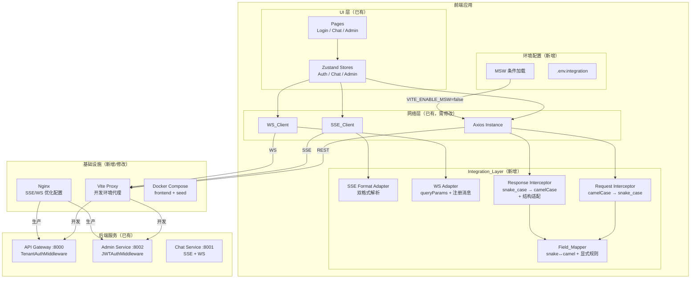
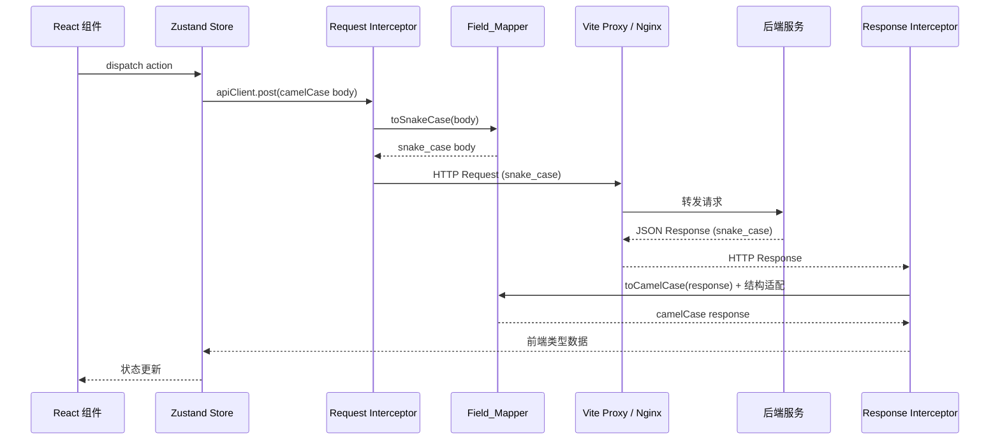
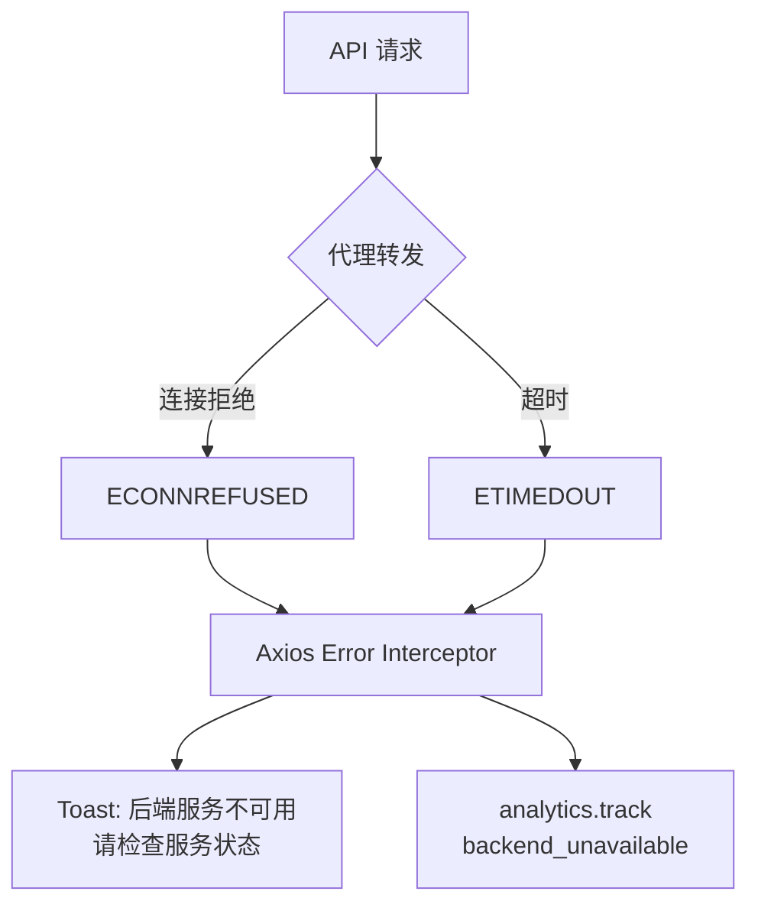

# 技术设计文档：Cuckoo-Echo 前后端联调

## 概述

本设计文档定义 Cuckoo-Echo 前后端联调适配层（Integration_Layer）的技术架构。前端 UI 已完成全部组件实现（136 测试），后端已完成全部 10 阶段开发（303 测试）。当前前端通过 MSW 模拟所有 API 调用，本文档设计将 MSW 模拟替换为真实后端对接所需的全部适配工作。

### 核心设计决策

| 决策 | 选择 | 理由 |
|------|------|------|
| 字段转换方案 | `camelcase-keys` + `snakecase-keys` + 显式规则表 | 成熟库处理通用转换，显式规则表处理 `primaryModel→model`、`doc_id→id` 等非标准映射 |
| 转换注入点 | Axios Interceptor（Request + Response） | 全局统一，Store 层无需感知后端字段风格 |
| SSE 格式适配 | 双格式检测（`content` 优先，回退 `choices[0].delta.content`） | 兼容后端实际格式和 OpenAI 格式，降低迁移风险 |
| MSW 切换 | `VITE_ENABLE_MSW` 环境变量 | 零代码改动切换开发/联调模式 |
| E2E 测试 | 独立 `playwright.integration.config.ts` | 与现有 MSW 模式 E2E 共存，互不干扰 |

---

## 架构

### 联调适配层架构图



### 数据流：API 请求完整链路



---

## 组件与接口

### 1. Field_Mapper 模块（`network/fieldMapper.ts`）

Field_Mapper 负责后端 snake_case 与前端 camelCase 之间的双向转换，以及非标准字段映射和结构差异适配。

#### 通用转换

使用 `camelcase-keys` 和 `snakecase-keys` 库处理通用命名风格转换：

```typescript
import camelcaseKeys from 'camelcase-keys';
import snakecaseKeys from 'snakecase-keys';

export function toCamelCase<T>(obj: unknown): T {
  return camelcaseKeys(obj as Record<string, unknown>, { deep: true }) as T;
}

export function toSnakeCase<T>(obj: unknown): T {
  return snakecaseKeys(obj as Record<string, unknown>, { deep: true }) as T;
}
```

#### 显式字段映射规则

对于通用 snake↔camel 转换无法覆盖的非标准映射，Field_Mapper 维护显式规则表：

```typescript
// 后端字段 → 前端字段（非标准映射）
const EXPLICIT_BACKEND_TO_FRONTEND: Record<string, Record<string, string>> = {
  '/admin/v1/knowledge/docs/*': {
    doc_id: 'id',
  },
  '/admin/v1/metrics/overview': {
    human_transfer_rate: 'humanEscalationRate',
  },
  '/admin/v1/metrics/missed-queries': {
    query_prefix: 'query',
  },
};

// 前端字段 → 后端字段（非标准映射）
const EXPLICIT_FRONTEND_TO_BACKEND: Record<string, Record<string, string>> = {
  '/admin/v1/config/model': {
    primaryModel: 'model',
  },
};
```

#### 结构适配器

处理后端响应结构与前端期望结构的差异：

```typescript
const STRUCTURE_ADAPTERS: Record<string, (data: unknown) => unknown> = {
  '/admin/v1/metrics/overview': (data) => {
    const d = data as Record<string, unknown>;
    return {
      ...d,
      aiResolutionRate: 1 - (Number(d.humanEscalationRate ?? d.human_transfer_rate) || 0),
      avgTtftMs: 0,
      totalTokensUsed: 0,
      totalTokensInput: 0,
      totalTokensOutput: 0,
    };
  },
  '/admin/v1/metrics/missed-queries': (data) => {
    const d = data as Record<string, unknown>;
    return (d.missed_queries ?? d.missedQueries) as unknown[];
  },
};
```

### 2. SSE Format Adapter（`network/sseClient.ts` 修改）

当前 SSE_Client 仅解析 OpenAI 格式 `{"choices":[{"delta":{"content":"..."}}]}`。需增加对后端实际格式 `{"content":"..."}` 的支持。

#### 双格式解析逻辑

```typescript
// 在 parseStream 的 JSON 解析部分替换为：
function extractTokenContent(parsed: Record<string, unknown>): string | undefined {
  // 优先检测后端实际格式：{content: "token_text"}
  if (typeof parsed.content === 'string') {
    return parsed.content;
  }
  // 回退到 OpenAI 格式：{choices: [{delta: {content: "..."}}]}
  const choices = parsed.choices as { delta?: { content?: string } }[] | undefined;
  return choices?.[0]?.delta?.content ?? undefined;
}

// 错误事件检测
function extractError(parsed: Record<string, unknown>): { code: string; message: string } | null {
  if (parsed.error && typeof parsed.error === 'string') {
    return { code: parsed.error as string, message: (parsed.message as string) ?? '' };
  }
  return null;
}
```

#### SSE 事件流格式对比

| 事件类型 | 后端实际格式（sse-starlette） | 前端当前期望（OpenAI） |
|---------|------------------------------|----------------------|
| Token | `data: {"content": "你好"}` | `data: {"choices":[{"delta":{"content":"你好"}}]}` |
| 错误 | `data: {"error": "CONCURRENT_REQUEST", "message": "..."}` | 无 |
| 结束 | `data: [DONE]` | `data: [DONE]` |

### 3. WebSocket Adapter（`network/wsClient.ts` 修改）

#### queryParams 支持

WSClient 的 `connect` 方法需支持 URL 查询参数拼接，用于 C 端 API Key 鉴权：

```typescript
interface WSClientOptions {
  url: string;
  queryParams?: Record<string, string>;  // 新增
  onMessage: (data: WSMessage) => void;
  onClose: () => void;
  onError: (error: Event) => void;
}

// connect 方法中：
const wsUrl = new URL(options.url);
if (options.queryParams) {
  Object.entries(options.queryParams).forEach(([k, v]) => wsUrl.searchParams.set(k, v));
}
this.ws = new WebSocket(wsUrl.toString());
```

#### Admin WS 初始注册消息

Admin HITL WebSocket 连接建立后需发送 `{tenant_id: "..."}` 注册消息：

```typescript
// 新增 onOpen 回调支持
interface WSClientOptions {
  // ...existing
  onOpen?: () => void;  // 新增
}

// 在 ws.onopen 中调用：
this.ws.onopen = () => {
  this.reconnectDelay = 1000;
  this.startHeartbeat();
  options.onOpen?.();  // 允许调用方发送注册消息
};
```

#### C 端 vs Admin 端 WebSocket 鉴权差异

| 端点 | 鉴权方式 | 连接 URL | 初始消息 |
|------|---------|---------|---------|
| `WS /v1/chat/ws` | URL 参数 `?api_key=xxx` | `ws://host/v1/chat/ws?api_key=ck_xxx` | 无 |
| `WS /admin/v1/ws/hitl` | JWT（已通过 Nginx 代理） | `ws://host/admin/v1/ws/hitl` | `{"tenant_id": "..."}` |

### 4. Axios Interceptor 集成

#### Request Interceptor（camelCase → snake_case）

```typescript
apiClient.interceptors.request.use((config) => {
  // 注入 Bearer token（已有逻辑）
  const token = getAccessToken();
  if (token) config.headers.Authorization = `Bearer ${token}`;

  // 新增：请求体 camelCase → snake_case 转换
  if (config.data && typeof config.data === 'object' && !(config.data instanceof FormData)) {
    const endpoint = config.url ?? '';
    config.data = toSnakeCaseWithExplicit(config.data, endpoint);
  }
  return config;
});
```

#### Response Interceptor（snake_case → camelCase + 结构适配）

```typescript
apiClient.interceptors.response.use(
  (response) => {
    const endpoint = response.config.url ?? '';
    // 1. 应用显式字段映射
    // 2. 通用 snake_case → camelCase
    // 3. 应用结构适配器
    response.data = transformResponse(response.data, endpoint);
    return response;
  },
  // ...existing error handling
);
```

### 5. Vite Proxy 配置

在 `vite.config.ts` 中新增开发代理规则：

```typescript
server: {
  proxy: {
    '/admin/v1/': {
      target: 'http://localhost:8002',
      changeOrigin: true,
      ws: true,  // 支持 WS /admin/v1/ws/hitl
    },
    '/v1/': {
      target: 'http://localhost:8000',
      changeOrigin: true,
      ws: true,  // 支持 WS /v1/chat/ws
    },
  },
},
```

注意：`/admin/v1/` 必须在 `/v1/` 之前声明，确保 Admin 路径优先匹配。

### 6. Nginx 配置更新

在现有 `nginx.conf` 基础上增加 SSE 和 WebSocket 优化配置：

```nginx
# SSE 流式接口 — 禁用缓冲
location /v1/chat/completions {
    proxy_pass http://api-gateway:8000;
    proxy_http_version 1.1;
    proxy_buffering off;
    proxy_cache off;
    proxy_set_header Connection '';
    proxy_set_header X-Accel-Buffering no;
    proxy_read_timeout 300s;
    proxy_set_header Host $host;
    proxy_set_header X-Real-IP $remote_addr;
    proxy_set_header X-Forwarded-For $proxy_add_x_forwarded_for;
}

# WebSocket — 延长超时
location /v1/chat/ws {
    proxy_pass http://api-gateway:8000;
    proxy_http_version 1.1;
    proxy_set_header Upgrade $http_upgrade;
    proxy_set_header Connection "upgrade";
    proxy_read_timeout 300s;
    proxy_send_timeout 300s;
    proxy_set_header Host $host;
}

location /admin/v1/ws/ {
    proxy_pass http://admin-service:8002;
    proxy_http_version 1.1;
    proxy_set_header Upgrade $http_upgrade;
    proxy_set_header Connection "upgrade";
    proxy_read_timeout 300s;
    proxy_send_timeout 300s;
    proxy_set_header Host $host;
}

# 健康检查端点
location = /nginx-health {
    access_log off;
    return 200 'ok';
    add_header Content-Type text/plain;
}
```

### 7. MSW 条件加载

修改 `main.tsx` 入口，根据环境变量决定是否启用 MSW：

```typescript
async function bootstrap() {
  if (import.meta.env.VITE_ENABLE_MSW === 'true') {
    const { worker } = await import('./mocks/browser');
    await worker.start({ onUnhandledRequest: 'bypass' });
  } else {
    // 清理残留 Service Worker
    const registrations = await navigator.serviceWorker?.getRegistrations();
    for (const reg of registrations ?? []) {
      if (reg.active?.scriptURL.includes('mockServiceWorker')) {
        await reg.unregister();
      }
    }
  }

  createRoot(document.getElementById('root')!).render(
    <StrictMode><App /></StrictMode>
  );
}

bootstrap();
```

### 8. Docker Compose 新增服务

在现有 `docker-compose.yml` 中新增 `frontend` 和 `seed` 服务：

```yaml
  frontend:
    build:
      context: ./frontend
      dockerfile: Dockerfile
    ports:
      - "80:80"
    depends_on:
      api-gateway:
        condition: service_started
      admin-service:
        condition: service_started
    healthcheck:
      test: ["CMD-SHELL", "curl -f http://localhost/nginx-health || exit 1"]
      interval: 10s
      timeout: 5s
      retries: 3

  seed:
    build:
      context: .
      dockerfile: k8s/Dockerfile
    command: ["python", "-m", "scripts.seed"]
    env_file: .env.docker
    depends_on:
      migrate:
        condition: service_completed_successfully
      postgres:
        condition: service_healthy
```

### 9. Seed Script（`scripts/seed.py`）

幂等种子脚本，为联调和 E2E 测试创建测试数据：

```python
# scripts/seed.py
async def seed():
    """创建测试租户、API Key、Admin 用户（幂等）"""
    # 1. 创建测试租户（IF NOT EXISTS）
    #    tenant_id = 'test-tenant-001'
    #    api_key = 'ck_test_integration_key'
    #    api_key_hash = sha256(api_key)
    #
    # 2. 创建 Admin 用户（IF NOT EXISTS）
    #    email = 'admin@test.com'
    #    password = bcrypt('test123456')
    #    tenant_id = 'test-tenant-001'
    #
    # 3. 初始化默认配置
    #    llm_config = {system_prompt, persona_name, model, temperature}
    #    rate_limit = {tenant_rps: 100, user_rps: 10}
```

### 10. E2E 测试配置（`playwright.integration.config.ts`）

```typescript
import { defineConfig } from '@playwright/test';

export default defineConfig({
  testDir: './e2e',
  testMatch: '**/*.integration.spec.ts',
  use: {
    baseURL: process.env.E2E_BASE_URL ?? 'http://localhost',
    extraHTTPHeaders: {
      'X-Test-Mode': 'integration',
    },
  },
  webServer: undefined,  // 不启动 Vite dev server，使用 Docker Compose 服务
  retries: 1,
  timeout: 60_000,
});
```

---

## 数据模型

### 后端 → 前端字段映射总表

#### 认证接口

| 接口 | 后端响应字段 | 前端类型字段 | 转换说明 |
|------|------------|------------|---------|
| `POST /admin/v1/auth/login` | `access_token` | `accessToken` | 通用 snake→camel |
| | `token_type` | `tokenType` | 通用 |
| | `expires_in` | `expiresIn` | 通用 |
| JWT payload | `admin_user_id` | `AdminUser.id` | 显式映射 |
| | `tenant_id` | `AdminUser.tenantId` | 通用 |
| | `role` | `AdminUser.role` | 直接使用 |
| | ❌ 无 `email` | `AdminUser.email` | 使用 `admin_user_id` 作为回退 |
| | ❌ 无 `tenant_name` | `AdminUser.tenantName` | 使用 `tenant_id` 作为回退 |

#### HITL 接口

| 接口 | 后端响应字段 | 前端类型字段 | 转换说明 |
|------|------------|------------|---------|
| `POST /admin/v1/hitl/{id}/take` | `session_id` | `sessionId` | 通用 |
| | `thread_id` | `threadId` | 通用 |
| | `status` | `status` | 直接使用 |
| WS `hitl_request` 事件 | `session_id` | `HITLSession.sessionId` | 通用 |
| | `thread_id` | `HITLSession.threadId` | 通用 |
| | `reason` | `HITLSession.reason` | 直接使用 |
| | `unresolved_turns` | `HITLSession.unresolvedTurns` | 通用 |

#### 知识库接口

| 接口 | 后端响应字段 | 前端类型字段 | 转换说明 |
|------|------------|------------|---------|
| `POST /admin/v1/knowledge/docs` | `doc_id` | `id` | **显式映射** |
| | `status` | `status` | 直接使用 |
| `GET /admin/v1/knowledge/docs/{id}` | `doc_id` | `id` | **显式映射** |
| | `status` | `status` | 直接使用 |
| | `chunk_count` | `chunkCount` | 通用 |
| | `error_msg` | `errorMsg` | 通用 |
| | ❌ 无 `filename` | `filename` | 需从列表接口获取 |
| | ❌ 无 `created_at` | `createdAt` | 需从列表接口获取 |
| `DELETE /admin/v1/knowledge/docs/{id}` | `{doc_id, deleted: true}` | HTTP 204 | 兼容两种格式 |

#### 指标接口

| 接口 | 后端响应字段 | 前端类型字段 | 转换说明 |
|------|------------|------------|---------|
| `GET /admin/v1/metrics/overview` | `total_conversations` | `totalConversations` | 通用 |
| | `human_transfer_count` | `humanTransferCount` | 通用 |
| | `human_transfer_rate` | `humanEscalationRate` | **显式映射** |
| | ❌ 无 | `aiResolutionRate` | **计算字段**: `1 - humanEscalationRate` |
| | ❌ 无 | `avgTtftMs` | 默认值 `0` |
| | ❌ 无 | `totalTokensUsed` | 默认值 `0` |
| `GET /admin/v1/metrics/tokens` | `total_tokens` | `totalTokensUsed` | **显式映射** |
| | `message_count` | `messageCount` | 通用 |
| `GET /admin/v1/metrics/missed-queries` | `{missed_queries: [...]}` | `[...]` | **结构解包** |
| | `query_prefix` | `query` | **显式映射** |

#### 配置接口（前端 → 后端）

| 接口 | 前端请求字段 | 后端期望字段 | 转换说明 |
|------|------------|------------|---------|
| `PUT /admin/v1/config/persona` | `systemPrompt` | `system_prompt` | 通用 |
| | `personaName` | `persona_name` | 通用 |
| `PUT /admin/v1/config/model` | `primaryModel` | `model` | **显式映射** |
| | `fallbackModel` | `fallback_model` | 通用 |
| | `temperature` | `temperature` | 直接使用 |
| `PUT /admin/v1/config/rate-limit` | `tenantRps` | `tenant_rps` | 通用 |
| | `userRps` | `user_rps` | 通用 |

#### 沙盒接口（前端 → 后端）

| 接口 | 前端请求字段 | 后端期望字段 | 转换说明 |
|------|------------|------------|---------|
| `POST /admin/v1/metrics/sandbox/run` | `testCases` | `test_cases` | 通用 |
| | `testCases[].query` | `test_cases[].query` | 直接使用 |
| | `testCases[].reference` | `test_cases[].reference` | 直接使用 |
| | `testCases[].contexts` | `test_cases[].contexts` | 直接使用 |

#### 聊天接口

| 接口 | 后端响应字段 | 前端类型字段 | 转换说明 |
|------|------------|------------|---------|
| `GET /v1/threads/{id}` | `thread_id` | `threadId` | 通用 |
| | `messages` (LangGraph 格式) | `Message[]` | **LangGraph 消息转换** |
| `POST /v1/chat/completions` SSE | `{"content": "token"}` | `onToken(token)` | SSE 格式适配 |
| | `[DONE]` | `onDone()` | 直接使用 |
| `WS /v1/chat/ws` | `{"content": "token"}` | `onMessage({content})` | 直接使用 |
| | `{"done": true}` | 完成标记 | 直接使用 |

### LangGraph 消息格式转换

后端 `GET /v1/threads/{thread_id}` 返回 LangGraph checkpoint 中的消息对象，格式与前端 `Message` 类型不同：

```typescript
// LangGraph 消息格式（后端返回）
interface LangGraphMessage {
  type: 'human' | 'ai' | 'tool';
  content: string;
  id?: string;
  tool_calls?: { id: string; name: string; args: Record<string, unknown> }[];
  additional_kwargs?: Record<string, unknown>;
}

// 转换函数
function convertLangGraphMessage(msg: LangGraphMessage, threadId: string): Message {
  const roleMap: Record<string, MessageRole> = {
    human: 'user',
    ai: 'assistant',
  };
  return {
    id: msg.id ?? crypto.randomUUID(),
    threadId,
    role: roleMap[msg.type] ?? 'assistant',
    content: msg.content,
    toolCalls: msg.tool_calls?.map(tc => ({
      id: tc.id,
      name: tc.name,
      arguments: JSON.stringify(tc.args),
    })),
    createdAt: new Date().toISOString(),
  };
}
```

### JWT Payload 解码适配

后端 JWT payload 字段与前端 `AdminUser` 类型的差异处理：

```typescript
// 后端实际 JWT payload
interface BackendJWTPayload {
  admin_user_id: string;  // 前端期望 sub/id
  tenant_id: string;
  role: string;
  exp: number;
  iat: number;
  // 注意：无 email、无 tenant_name
}

// 适配后的 decodeJwtPayload
function userFromBackendPayload(payload: BackendJWTPayload): AdminUser {
  return {
    id: payload.admin_user_id,
    email: payload.admin_user_id,      // 回退：使用 ID 作为显示名
    tenantId: payload.tenant_id,
    tenantName: payload.tenant_id,     // 回退：使用 ID 作为租户名
    role: payload.role,
  };
}
```

### MSW Handler 与后端实际差异汇总

| 功能 | MSW 当前行为 | 后端实际行为 | 需要适配 |
|------|------------|------------|---------|
| 登录响应 | JWT 含 `email`、`tenant_name` | JWT 仅含 `admin_user_id`、`tenant_id`、`role` | ✅ |
| 配置接口响应 | HTTP 204 | HTTP 200 + `{updated: true}` | ✅ |
| 删除文档响应 | HTTP 204 | HTTP 200 + `{doc_id, deleted: true}` | ✅ |
| 缓存清除路径 | `/admin/v1/cache/clear` | `/admin/v1/config/cache/clear` | ✅ |
| 沙盒路径 | `/admin/v1/sandbox/run` | `/admin/v1/metrics/sandbox/run` | ✅ |
| 未命中查询响应 | 直接数组 `[{query, count}]` | 包裹对象 `{missed_queries: [...]}` | ✅ |
| 指标概览 | 含 `aiResolutionRate` 等全部字段 | 仅含 `total_conversations`、`human_transfer_count`、`human_transfer_rate` | ✅ |
| SSE 格式 | OpenAI `choices[0].delta.content` | 后端 `{content: "..."}` | ✅ |
| 线程历史 | `{messages: Message[]}` | `{thread_id, messages: LangGraphMessage[]}` | ✅ |

---

## 正确性属性

*正确性属性（Correctness Property）是系统在所有合法执行路径下都应满足的特征或行为——本质上是对系统行为的形式化声明。属性是人类可读规格说明与机器可验证正确性保证之间的桥梁。*

以下属性基于需求文档中的验收标准，经过 Prework 分析和冗余消除后提炼而成。

### Property 1：字段映射往返一致性（Round-Trip）

*对于任意*合法的 snake_case 键值对象 `R`（键名由 1~3 个小写单词以下划线分隔组成，值为任意 JSON 值），经过 `toCamelCase(R)` 转换后再经过 `toSnakeCase` 转换，结果的键集合应等于原始对象 `R` 的键集合。

即：`keys(toSnakeCase(toCamelCase(R))) == keys(R)`

**Validates: Requirements 1.5**

### Property 2：SSE 双格式解析完整性

*对于任意* Token 序列 `[t1, t2, ..., tn]`（包含中文、英文、特殊字符、空字符串），无论以后端格式 `data: {"content": "ti"}` 还是 OpenAI 格式 `data: {"choices":[{"delta":{"content":"ti"}}]}` 编码，经过 SSE_Client 的 `extractTokenContent` 解析后，提取的 Token 拼接结果应等于 `concat(t1, t2, ..., tn)`。

**Validates: Requirements 4.2**

### Property 3：API 响应结构映射完整性

*对于任意*后端 API 端点（overview、tokens、missed-queries、knowledge、hitl、config）返回的合法响应对象，经过 Field_Mapper 的完整转换链（显式映射 → 通用 snake→camel → 结构适配）后，结果对象应满足对应前端 TypeScript 类型的所有必需字段存在且类型正确。特别地：
- `overview` 响应的 `aiResolutionRate` 应等于 `1 - humanEscalationRate`
- `missed-queries` 响应应从包裹对象解包为数组
- `config/model` 请求的 `primaryModel` 应映射为 `model`
- `knowledge` 响应的 `doc_id` 应映射为 `id`

**Validates: Requirements 1.1, 1.4, 7.1, 7.3, 7.4**

### Property 4：JWT Payload 解码与回退字段

*对于任意*后端签发的合法 JWT（payload 包含 `admin_user_id`、`tenant_id`、`role`、`exp`、`iat`，但不包含 `email` 和 `tenant_name`），经过 `userFromBackendPayload` 转换后，结果 `AdminUser` 对象应满足：
- `id` 等于 payload 的 `admin_user_id`
- `tenantId` 等于 payload 的 `tenant_id`
- `role` 等于 payload 的 `role`
- `email` 和 `tenantName` 为非空字符串（使用回退值）

**Validates: Requirements 3.2**

### Property 5：实时消息格式转换完整性

*对于任意*合法的 LangGraph 消息对象（type ∈ {human, ai}，content 为任意字符串），经过 `convertLangGraphMessage` 转换后，结果 `Message` 对象的 `role` 应正确映射（human→user, ai→assistant），`content` 应与原始 content 完全一致，且 `id`、`threadId`、`createdAt` 均为非空字符串。

同样，*对于任意*合法的 HITL WebSocket 事件（包含 `session_id`、`thread_id`、`reason`、`unresolved_turns`），经过 snake→camel 转换后，结果应满足 `HITLSession` 类型的所有必需字段。

**Validates: Requirements 4.5, 5.3**

### Property 6：指数退避延迟序列

*对于任意*连续失败次数 `n`（n ≥ 1），SSE_Client 和 WS_Client 的重连延迟应满足：
- 第 k 次重连延迟 = `min(1000 * 2^(k-1), 30000)` 毫秒
- 延迟序列严格递增直到达到上限 30000ms
- 成功连接后延迟重置为 1000ms

**Validates: Requirements 4.6**

---

## 错误处理

### 后端不可用场景



### 连接失败处理矩阵

| 场景 | 错误类型 | 处理方式 | 用户反馈 |
|------|---------|---------|---------|
| 后端服务未启动 | `ECONNREFUSED` / Network Error | 不重试 | Toast: "后端服务不可用，请检查服务状态" |
| SSE 流中断（无 [DONE]） | `STREAM_ERROR` | 指数退避重连 | Toast: "消息发送中断，请重试" |
| SSE 60s 无数据 | `STREAM_TIMEOUT` | 断开连接 | Toast: "消息发送中断，请重试" |
| WS 连接断开 | `onclose` | 指数退避重连 | 状态栏: "连接中…" |
| WS 被后端主动关闭 | `code=4001` | 不重连，展示错误 | Toast: "连接被拒绝：{reason}" |
| SSE 并发请求 | `CONCURRENT_REQUEST` | 不重试 | Toast: "AI 正在处理上一条消息，请稍候" |
| JWT 过期 | HTTP 401 + `Token expired` | Token Refresh → 重试 | 静默处理 / 跳转登录 |
| JWT 无效 | HTTP 401 + `Invalid token` | Token Refresh → 重试 | 静默处理 / 跳转登录 |
| 文件过大 | HTTP 413 | 不重试 | Toast: "文件过大（最大 50MB）" |
| 限流 | HTTP 429 | 读取 Retry-After，延迟重试 | Toast: "请求过于频繁，请稍后重试" |

### 后端错误码 → 前端提示映射

```typescript
// 扩展 errorMap.ts
export const ERROR_MAP: Record<number, string> = {
  401: '登录已过期，请重新登录',
  404: '请求的资源不存在',
  409: 'AI 正在处理上一条消息，请稍候',
  413: '文件过大（最大 50MB）',
  415: '不支持该文件格式',
  429: '请求过于频繁，请稍后重试',
  500: '服务器内部错误，请稍后重试',
  503: '系统繁忙，请稍后重试',
};

// SSE 错误码映射
export const SSE_ERROR_MAP: Record<string, string> = {
  CONCURRENT_REQUEST: 'AI 正在处理上一条消息，请稍候',
  STREAM_TIMEOUT: '消息发送中断，请重试',
  NETWORK_ERROR: '网络连接失败，请检查网络',
};
```

### WebSocket 关闭码处理

```typescript
// WS 关闭码 → 用户提示
const WS_CLOSE_MAP: Record<number, { message: string; shouldReconnect: boolean }> = {
  1000: { message: '', shouldReconnect: false },                    // 正常关闭
  1006: { message: '连接异常断开', shouldReconnect: true },          // 异常断开
  4001: { message: '连接被拒绝：缺少租户信息', shouldReconnect: false }, // tenant_id required
};
```

---

## 测试策略

### 双轨测试方法

本项目采用单元测试 + 属性测试（Property-Based Testing）双轨并行的测试策略：

- **单元测试（Vitest）**：验证具体示例、边界条件、错误场景、集成点
- **属性测试（fast-check + Vitest）**：验证跨所有输入的通用属性（正确性属性 P1-P6）

两者互补：单元测试捕获具体 Bug，属性测试验证通用正确性。

### 属性测试配置

- **PBT 库**：fast-check（TypeScript 原生支持，与 Vitest 集成良好）
- **最小迭代次数**：每个属性测试至少运行 100 次
- **标签格式**：每个属性测试必须包含注释引用设计文档中的属性编号
- **每个正确性属性由单个属性测试实现**

```typescript
// 标签格式示例
// Feature: frontend-integration, Property 1: 字段映射往返一致性（Round-Trip）
```

### 属性测试矩阵

| 属性 | 测试文件 | 生成器 |
|------|---------|--------|
| P1: 字段映射往返一致性 | `__tests__/pbt/p1-field-mapper-roundtrip.test.ts` | 随机 snake_case 键值对象（1~50 键，1~3 个下划线分隔单词） |
| P2: SSE 双格式解析完整性 | `__tests__/pbt/p2-sse-dual-format.test.ts` | 随机 Token 序列（1~200 个，含中文/英文/特殊字符），随机选择后端/OpenAI 格式 |
| P3: API 响应结构映射 | `__tests__/pbt/p3-api-structure-mapping.test.ts` | 为每个端点生成符合后端 schema 的随机响应对象 |
| P4: JWT Payload 解码 | `__tests__/pbt/p4-jwt-payload-decode.test.ts` | 随机 admin_user_id、tenant_id、role 字符串 |
| P5: 实时消息格式转换 | `__tests__/pbt/p5-realtime-message-convert.test.ts` | 随机 LangGraph 消息 + 随机 HITL WS 事件 |
| P6: 指数退避延迟 | `__tests__/pbt/p6-exponential-backoff.test.ts` | 随机连续失败次数（1~20） |

### 单元测试覆盖范围

| 模块 | 测试重点 |
|------|---------|
| `network/fieldMapper` | 显式映射规则、结构适配器、FormData 跳过、嵌套对象转换 |
| `network/sseClient` | 双格式解析、CONCURRENT_REQUEST 错误、[DONE] 检测、超时保护 |
| `network/wsClient` | queryParams 拼接、onOpen 回调、关闭码处理、心跳发送 |
| `network/axios` | Request/Response Interceptor 集成、Token 注入、错误映射 |
| `stores/authStore` | 后端 JWT 解码（无 email/tenant_name）、Token 刷新触发 |
| `stores/adminStore` | 配置接口 `{updated: true}` 响应处理、路径修正 |

### E2E 集成测试场景

| 场景 | 文件 | 验证点 |
|------|------|--------|
| Admin 登录 | `e2e/login.integration.spec.ts` | 真实 JWT 签发、页面跳转、用户信息展示 |
| 聊天流程 | `e2e/chat.integration.spec.ts` | SSE 流式响应、Token 拼接、消息完成 |
| 知识库上传 | `e2e/knowledge.integration.spec.ts` | 文件上传、状态轮询、字段映射 |
| HITL 流程 | `e2e/hitl.integration.spec.ts` | WebSocket 连接、HITL 事件接收、会话接管 |

### 环境配置文件

| 文件 | 用途 | 关键变量 |
|------|------|---------|
| `.env.development` | 纯前端开发（MSW 模式） | `VITE_ENABLE_MSW=true` |
| `.env.integration` | 联调模式 | `VITE_ENABLE_MSW=false`, `VITE_API_BASE_URL=` |
| `.env.docker` | Docker Compose 后端服务 | 数据库/Redis/Milvus 连接串 |