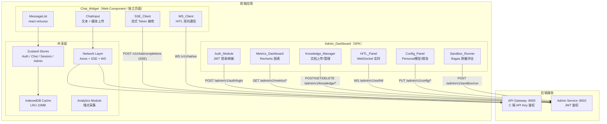
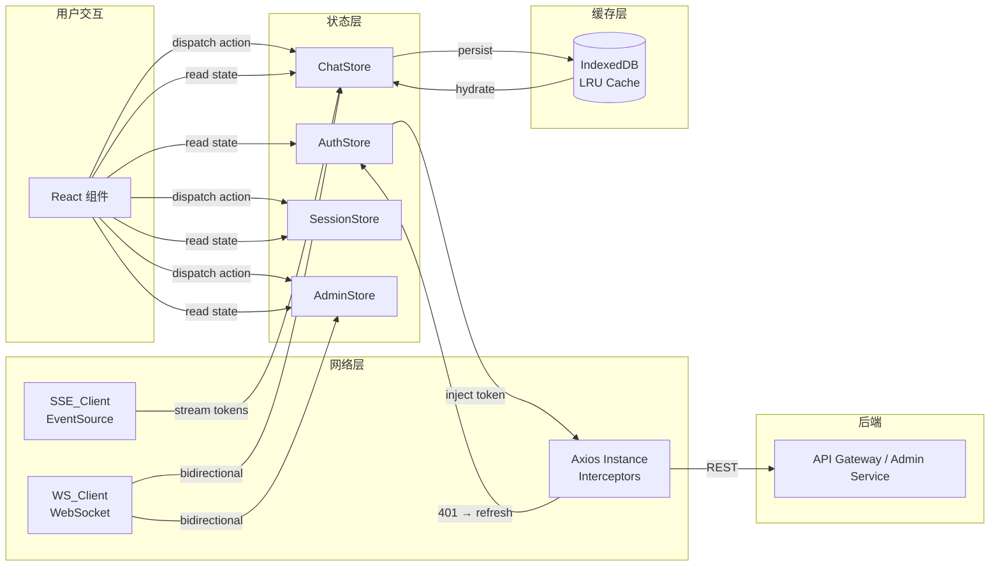

# 技术设计文档：Cuckoo-Echo 前端 UI

## 概述

本设计文档定义 Cuckoo-Echo 前端 UI 的技术架构，涵盖两大模块：

1. **Chat_Widget**：C 端用户聊天组件，可作为独立页面或通过 Web Component（Shadow DOM）嵌入企业网站
2. **Admin_Dashboard**：管理后台 SPA，供运营人员使用

前端基于 React 18 + TypeScript + Zustand + Radix UI + Tailwind CSS + Vite 构建，通过 SSE/WebSocket/REST 三种协议对接后端已有的 API Gateway（:8000）和 Admin Service（:8002）。

### 设计决策

| 决策 | 选择 | 理由 |
|------|------|------|
| 状态管理 | Zustand（4 个独立 Store） | 无 Provider 嵌套，支持 middleware（persist/devtools），按模块拆分避免全局 re-render |
| 流式渲染 | requestAnimationFrame 批量追加 | 避免每个 SSE Token 触发 React re-render，16ms 内累积后一次性更新 DOM |
| 虚拟滚动 | react-virtuoso | 动态高度测量 + ResizeObserver，适配 Markdown 代码块/图片等变高内容 |
| XSS 防御 | DOMPurify + react-markdown | 流式 Markdown 渲染前清洗 HTML，防止不闭合标签导致 DOM 崩溃 |
| 嵌入方案 | Web Component + Shadow DOM | 样式隔离，不污染宿主页面 CSS |
| 认证 | access_token 内存 + refresh_token httpOnly cookie | 防 XSS 窃取 token，Token Refresh Mutex 防并发刷新 |
| 离线缓存 | IndexedDB（idb-keyval） | 缓存最近消息和会话元数据，LRU 淘汰，10MB 上限 |
| 图表 | Recharts | 轻量、React 原生、满足折线图/柱状图需求 |

---

## 架构

### 系统架构图



### 前端目录结构

```
frontend/
├── public/
│   └── favicon.svg
├── src/
│   ├── main.tsx                    # Admin_Dashboard 入口
│   ├── embed.tsx                   # Chat_Widget Web Component 入口
│   ├── App.tsx                     # 路由根组件
│   ├── components/                 # 共享 UI 组件
│   │   ├── Toast.tsx
│   │   ├── Skeleton.tsx
│   │   ├── OfflineBanner.tsx
│   │   ├── ErrorBoundary.tsx
│   │   └── ConfirmDialog.tsx
│   ├── pages/                      # 页面组件
│   │   ├── LoginPage.tsx
│   │   ├── chat/
│   │   │   ├── ChatWidget.tsx
│   │   │   ├── MessageList.tsx
│   │   │   ├── MessageBubble.tsx
│   │   │   ├── ChatInput.tsx
│   │   │   ├── MediaUploader.tsx
│   │   │   ├── TypingIndicator.tsx
│   │   │   └── ThreadList.tsx
│   │   └── admin/
│   │       ├── DashboardLayout.tsx
│   │       ├── MetricsDashboard.tsx
│   │       ├── KnowledgeManager.tsx
│   │       ├── HITLPanel.tsx
│   │       ├── ConfigPanel.tsx
│   │       └── SandboxRunner.tsx
│   ├── stores/                     # Zustand 状态管理
│   │   ├── authStore.ts
│   │   ├── chatStore.ts
│   │   ├── sessionStore.ts
│   │   └── adminStore.ts
│   ├── network/                    # 网络层
│   │   ├── axios.ts                # Axios 实例 + Interceptors
│   │   ├── sseClient.ts           # SSE 客户端
│   │   └── wsClient.ts            # WebSocket 客户端
│   ├── hooks/                      # 自定义 Hooks
│   │   ├── useSSE.ts
│   │   ├── useWebSocket.ts
│   │   ├── useTokenRefresh.ts
│   │   ├── useFileValidation.ts
│   │   ├── useVirtualScroll.ts
│   │   └── useAnalytics.ts
│   ├── lib/                        # 工具函数
│   │   ├── sanitize.ts            # DOMPurify 封装
│   │   ├── cache.ts               # IndexedDB LRU 缓存
│   │   ├── fileValidation.ts      # 文件格式/大小校验
│   │   ├── imageCompress.ts       # Canvas 图片预压缩
│   │   ├── analytics.ts           # 埋点 SDK
│   │   └── errorMap.ts            # HTTP 状态码 → 用户提示映射
│   ├── types/                      # TypeScript 类型定义
│   │   └── index.ts
│   └── styles/
│       └── globals.css             # Tailwind 入口 + CSS 变量
├── index.html
├── vite.config.ts
├── tailwind.config.ts
├── tsconfig.json
├── package.json
└── Dockerfile
```


### 数据流架构



---

## 组件与接口

### 网络层设计

#### 1. Axios 实例（`network/axios.ts`）

```typescript
// 核心配置
const apiClient = axios.create({
  baseURL: import.meta.env.VITE_API_BASE_URL,
  timeout: 30_000,
  withCredentials: true, // 携带 httpOnly cookie
});

// Request Interceptor: 注入 JWT / API Key
apiClient.interceptors.request.use((config) => {
  const token = useAuthStore.getState().accessToken;
  if (token) {
    config.headers.Authorization = `Bearer ${token}`;
  }
  return config;
});

// Response Interceptor: 统一错误处理 + Token 刷新
apiClient.interceptors.response.use(
  (response) => response,
  async (error) => {
    if (error.response?.status === 401 && !error.config._retry) {
      error.config._retry = true;
      const newToken = await refreshTokenWithMutex();
      if (newToken) {
        error.config.headers.Authorization = `Bearer ${newToken}`;
        return apiClient(error.config);
      }
      // 刷新失败 → 跳转登录
      useAuthStore.getState().logout();
      window.location.href = '/login';
    }
    // 统一错误映射
    const message = ERROR_MAP[error.response?.status] ?? '未知错误，请稍后重试';
    showToast({ type: 'error', message });
    return Promise.reject(error);
  }
);
```

#### 2. SSE_Client（`network/sseClient.ts`）

```typescript
interface SSEClientOptions {
  url: string;
  body: object;
  apiKey: string;
  onToken: (token: string, messageId?: string) => void;
  onDone: (messageId: string) => void;
  onError: (error: SSEError) => void;
}

class SSEClient {
  private controller: AbortController | null = null;
  private reconnectDelay = 1000;
  private maxReconnectDelay = 30_000;

  async connect(options: SSEClientOptions): Promise<void> {
    this.controller = new AbortController();
    const response = await fetch(options.url, {
      method: 'POST',
      headers: {
        'Content-Type': 'application/json',
        'Authorization': `Bearer ${options.apiKey}`,
      },
      body: JSON.stringify(options.body),
      signal: this.controller.signal,
    });

    const reader = response.body!.getReader();
    const decoder = new TextDecoder();
    // 逐块解析 SSE data: 行，调用 onToken / onDone
    await this.parseStream(reader, decoder, options);
  }

  disconnect(): void {
    this.controller?.abort();
  }

  // 指数退避重连
  async reconnect(options: SSEClientOptions): Promise<void> {
    await sleep(this.reconnectDelay);
    this.reconnectDelay = Math.min(this.reconnectDelay * 2, this.maxReconnectDelay);
    await this.connect(options);
  }
}
```

#### 3. WS_Client（`network/wsClient.ts`）

```typescript
interface WSClientOptions {
  url: string;
  onMessage: (data: WSMessage) => void;
  onClose: () => void;
  onError: (error: Event) => void;
}

class WSClient {
  private ws: WebSocket | null = null;
  private heartbeatTimer: number | null = null;
  private reconnectDelay = 1000;
  private maxReconnectDelay = 30_000;

  connect(options: WSClientOptions): void {
    this.ws = new WebSocket(options.url);
    this.ws.onopen = () => {
      this.reconnectDelay = 1000; // 重置退避
      this.startHeartbeat();
    };
    this.ws.onmessage = (e) => options.onMessage(JSON.parse(e.data));
    this.ws.onclose = () => {
      this.stopHeartbeat();
      this.reconnect(options);
    };
  }

  send(data: object): void {
    this.ws?.send(JSON.stringify(data));
  }

  // 心跳：每 30 秒发送 ping
  private startHeartbeat(): void {
    this.heartbeatTimer = window.setInterval(() => {
      this.ws?.send(JSON.stringify({ type: 'ping' }));
    }, 30_000);
  }

  // 指数退避重连
  private async reconnect(options: WSClientOptions): Promise<void> {
    await sleep(this.reconnectDelay);
    this.reconnectDelay = Math.min(this.reconnectDelay * 2, this.maxReconnectDelay);
    this.connect(options);
  }
}
```

### Token Refresh Mutex

```typescript
// lib/tokenRefresh.ts
let refreshPromise: Promise<string | null> | null = null;

export async function refreshTokenWithMutex(): Promise<string | null> {
  // 如果已有刷新请求在进行中，等待其结果
  if (refreshPromise) return refreshPromise;

  refreshPromise = (async () => {
    try {
      const res = await axios.post('/admin/v1/auth/refresh', null, {
        withCredentials: true,
      });
      const newToken = res.data.access_token;
      useAuthStore.getState().setAccessToken(newToken);
      return newToken;
    } catch {
      return null;
    } finally {
      refreshPromise = null;
    }
  })();

  return refreshPromise;
}
```

### 页面组件接口

#### ChatWidget

```typescript
interface ChatWidgetProps {
  apiKey: string;
  theme?: 'light' | 'dark';
  position?: 'bottom-right' | 'bottom-left';
  lang?: 'zh-CN' | 'en';
  primaryColor?: string;
  bgColor?: string;
  logoUrl?: string;
}
```

核心职责：
- 管理 SSE ↔ WebSocket 协议切换（基于 SessionContext 状态）
- requestAnimationFrame 批量渲染 Token
- Optimistic UI：发送消息时立即展示（temp_id），后端确认后替换
- 虚拟滚动（react-virtuoso）渲染消息列表

#### DashboardLayout

```typescript
// 侧边栏导航 + 内容区域
// 路由：/admin/metrics | /admin/knowledge | /admin/hitl | /admin/config | /admin/sandbox
// 顶部展示当前用户邮箱 + 租户名称
// 响应式：桌面端侧边栏固定，平板端可折叠
```

#### MessageBubble

```typescript
interface MessageBubbleProps {
  message: Message;
  isStreaming?: boolean;  // 是否正在流式接收
}
// 渲染逻辑：
// - user 消息：右对齐，品牌色背景
// - assistant 消息：左对齐，react-markdown 渲染，DOMPurify 清洗
// - human_agent 消息：左对齐，不同颜色/图标标记"人工客服"
// - 底部：时间戳 + 反馈按钮（仅 assistant）
```

### 自定义 Hooks

| Hook | 职责 |
|------|------|
| `useSSE(threadId)` | 管理 SSE 连接生命周期，Token 累积 + rAF 批量更新 |
| `useWebSocket(url)` | 管理 WS 连接、心跳、重连、消息分发 |
| `useTokenRefresh()` | 监听 JWT 过期时间，提前 1 小时触发静默刷新 |
| `useFileValidation()` | 文件格式/大小校验，返回 `{ isValid, error }` |
| `useVirtualScroll()` | react-virtuoso 配置封装，动态高度 + 自动滚动 |
| `useAnalytics()` | 埋点事件上报，环境判断 + 隐私合规 |


---

## 数据模型

### Zustand Store 设计

#### AuthStore（`stores/authStore.ts`）

```typescript
interface AuthState {
  accessToken: string | null;
  user: AdminUser | null;
  isAuthenticated: boolean;

  // Actions
  login: (email: string, password: string) => Promise<void>;
  logout: () => void;
  setAccessToken: (token: string) => void;
  checkTokenExpiry: () => boolean; // 剩余 < 1h 返回 true
}

interface AdminUser {
  id: string;
  email: string;
  tenantId: string;
  tenantName: string;
  role: string;
}
```

#### ChatStore（`stores/chatStore.ts`）

```typescript
interface ChatState {
  messages: Message[];
  activeThreadId: string | null;
  isStreaming: boolean;
  streamingContent: string;  // rAF 累积的当前流式内容
  connectionStatus: 'connected' | 'connecting' | 'disconnected';

  // Actions
  sendMessage: (content: string, media?: MediaAttachment[]) => void;
  appendToken: (token: string) => void;
  finishStreaming: (messageId: string) => void;
  replaceTempId: (tempId: string, realId: string) => void;
  loadThread: (threadId: string) => Promise<void>;
  reconcileMessages: (serverMessages: Message[]) => void;
  setConnectionStatus: (status: ConnectionStatus) => void;
}

interface Message {
  id: string;           // temp_xxx 或真实 ID
  threadId: string;
  role: 'user' | 'assistant' | 'human_agent';
  content: string;
  mediaAttachments?: MediaAttachment[];
  toolCalls?: ToolCall[];
  createdAt: string;    // ISO 8601
  isOptimistic?: boolean;
  rating?: 'up' | 'down' | null;
  ratingReason?: string;
}

interface MediaAttachment {
  type: 'image' | 'audio';
  url: string;
  thumbnailUrl?: string;
  mimeType: string;
  sizeKb: number;
}
```

#### SessionStore（`stores/sessionStore.ts`）

```typescript
interface SessionState {
  // 会话状态：单一数据源
  status: 'active' | 'hitl_pending' | 'hitl_active' | 'resolved';
  threads: ThreadMeta[];
  activeThreadId: string | null;
  protocol: 'sse' | 'websocket';  // 当前通信协议

  // Actions
  createThread: () => string;       // 生成 uuidv4
  switchThread: (threadId: string) => void;
  setStatus: (status: SessionStatus) => void;
  switchProtocol: (protocol: 'sse' | 'websocket') => void;
}

interface ThreadMeta {
  id: string;
  title: string;        // 首条消息摘要
  lastMessageAt: string;
  messageCount: number;
}
```

#### AdminStore（`stores/adminStore.ts`）

```typescript
interface AdminState {
  // Knowledge
  documents: KnowledgeDoc[];
  docFilter: { search: string; status: DocStatus | 'all' };

  // HITL
  hitlSessions: HITLSession[];
  activeHitlSession: HITLSession | null;

  // Config
  persona: PersonaConfig | null;
  modelConfig: ModelConfig | null;
  rateLimitConfig: RateLimitConfig | null;

  // Metrics
  metricsOverview: MetricsOverview | null;
  metricsPeriod: '1d' | '7d' | '30d';

  // Sandbox
  sandboxResults: SandboxResult[];

  // Actions
  fetchDocuments: () => Promise<void>;
  uploadDocument: (file: File) => Promise<void>;
  deleteDocument: (id: string) => Promise<void>;
  takeHitlSession: (sessionId: string) => Promise<void>;
  endHitlSession: (sessionId: string) => Promise<void>;
  savePersona: (config: PersonaConfig) => Promise<void>;
  saveModelConfig: (config: ModelConfig) => Promise<void>;
  saveRateLimitConfig: (config: RateLimitConfig) => Promise<void>;
  fetchMetrics: (period: string) => Promise<void>;
  runSandbox: (testCases: TestCase[]) => Promise<void>;
}

interface KnowledgeDoc {
  id: string;
  filename: string;
  status: 'pending' | 'processing' | 'completed' | 'failed';
  chunkCount: number;
  errorMsg?: string;
  createdAt: string;
  updatedAt: string;
}

interface HITLSession {
  sessionId: string;
  threadId: string;
  status: 'pending' | 'active' | 'resolved' | 'auto_escalated';
  adminUserId?: string;
  reason: string;
  unresolvedTurns: number;
  createdAt: string;
}

interface PersonaConfig {
  systemPrompt: string;
  personaName: string;
  greeting: string;
}

interface ModelConfig {
  primaryModel: string;
  fallbackModel: string;
  temperature: number;  // 0.0 ~ 1.0
}

interface RateLimitConfig {
  tenantRps: number;
  userRps: number;
}

interface MetricsOverview {
  totalConversations: number;
  aiResolutionRate: number;
  humanEscalationRate: number;
  avgTtftMs: number;
  totalTokensUsed: number;
  totalTokensInput: number;
  totalTokensOutput: number;
  thumbUpRate?: number;
}

interface TestCase {
  query: string;
  reference: string;
  contexts: string[];
}

interface SandboxResult {
  testCase: TestCase;
  scores: {
    faithfulness: number;
    contextPrecision: number;
    contextRecall: number;
    answerRelevancy: number;
  };
  thresholds: Record<string, number>;
  passed: boolean;
}
```

### IndexedDB 缓存模型

```typescript
// lib/cache.ts
interface CacheConfig {
  maxSizeBytes: number;    // 10 * 1024 * 1024 (10MB)
  maxMessages: number;     // 50 条/会话
  maxThreads: number;      // 20 个会话元数据
  ttlDays: number;         // 7 天
}

interface CachedThread {
  id: string;
  meta: ThreadMeta;
  messages: Message[];     // 最近 50 条
  cachedAt: number;        // timestamp
  sizeBytes: number;       // 用于 LRU 淘汰计算
}

// LRU 淘汰策略：
// 1. 写入时检查总大小是否超过 maxSizeBytes
// 2. 超过时按 cachedAt 升序删除最旧的 CachedThread
// 3. 过期检查：cachedAt + ttlDays < now 的记录自动清除
```

### 路由表

```typescript
// App.tsx 路由配置
const routes = [
  { path: '/login', element: <LoginPage />, public: true },
  { path: '/chat', element: <ChatWidget />, public: true },  // API Key 鉴权
  {
    path: '/admin',
    element: <ProtectedRoute><DashboardLayout /></ProtectedRoute>,
    children: [
      { index: true, element: <Navigate to="/admin/metrics" /> },
      { path: 'metrics', element: <MetricsDashboard /> },
      { path: 'knowledge', element: <KnowledgeManager /> },
      { path: 'hitl', element: <HITLPanel /> },
      { path: 'config', element: <ConfigPanel /> },
      { path: 'sandbox', element: <SandboxRunner /> },
    ],
  },
];
```

### HTTP 错误码映射表

```typescript
// lib/errorMap.ts
export const ERROR_MAP: Record<number, string> = {
  401: '登录已过期，请重新登录',
  409: 'AI 正在处理上一条消息，请稍候',
  415: '不支持该文件格式',
  429: '请求过于频繁，请稍后重试',
  500: '服务器内部错误，请稍后重试',
  503: '系统繁忙，请稍后重试',
};
```

### 文件校验规则

```typescript
// lib/fileValidation.ts
interface ValidationRule {
  maxSizeMb: number;
  allowedTypes: string[];
}

export const FILE_RULES: Record<string, ValidationRule> = {
  image: {
    maxSizeMb: 10,
    allowedTypes: ['image/jpeg', 'image/png', 'image/webp'],
  },
  audio: {
    maxSizeMb: 5,
    allowedTypes: ['audio/wav', 'audio/mpeg', 'audio/mp4'],
  },
  document: {
    maxSizeMb: 50,
    allowedTypes: [
      'application/pdf',
      'application/vnd.openxmlformats-officedocument.wordprocessingml.document',
      'text/html',
      'text/plain',
    ],
  },
};

export function validateFile(
  file: File,
  category: 'image' | 'audio' | 'document'
): { isValid: boolean; error?: string } {
  const rule = FILE_RULES[category];
  if (!rule.allowedTypes.includes(file.type)) {
    return { isValid: false, error: '不支持该文件格式' };
  }
  if (file.size > rule.maxSizeMb * 1024 * 1024) {
    return { isValid: false, error: `文件过大，最大支持 ${rule.maxSizeMb} MB` };
  }
  return { isValid: true };
}
```


---

## 正确性属性

*正确性属性（Correctness Property）是系统在所有合法执行路径下都应满足的特征或行为——本质上是对系统行为的形式化声明。属性是人类可读规格说明与机器可验证正确性保证之间的桥梁。*

以下属性基于需求文档中的验收标准，经过 Prework 分析和冗余消除后提炼而成。每个属性都包含显式的全称量化（"对于任意"），可直接用于 Property-Based Testing（fast-check）。

### Property 1：SSE Token 流渲染完整性（Round-Trip）

*对于任意*合法的 SSE Token 序列 `[t1, t2, ..., tn]`（包含中文、英文、特殊字符、Markdown 标记），当 SSE 流以 `[DONE]` 结束后，Chat_Widget 最终渲染的 Message_Bubble 纯文本内容应等于所有 Token 的拼接结果 `concat(t1, t2, ..., tn)`（经 Markdown 渲染后提取纯文本）。

**Validates: Requirements 1.1, 1.2**

### Property 2：消息顺序不变量

*对于任意*会话中的消息集合 `[m1, m2, ..., mn]`（带有随机时间戳），Chat_Widget 渲染的消息 DOM 顺序应与消息按 `createdAt` 时间戳升序排列的顺序一致。

**Validates: Requirements 1.8, 3.2**

### Property 3：JWT 令牌生命周期不变量

*对于任意*时刻从 Admin_Dashboard 发出的 API 请求，要么请求的 `Authorization` Header 中包含未过期的 JWT access_token，要么用户已被重定向至 `/login` 页面。当多个请求并发触发 Token 刷新时，实际发出的刷新请求应恰好为 1 次（Token Refresh Mutex）。

**Validates: Requirements 4.2, 4.4, 4.6**

### Property 4：文件上传客户端校验幂等性

*对于任意*文件对象（随机大小 0~100MB、随机 MIME 类型），客户端校验函数 `validateFile(file, category)` 的结果是确定性的：对同一文件多次调用应返回完全相同的 `{ isValid, error }` 结果。且校验逻辑满足：文件大小超过类别限制时返回 `isValid=false`，文件类型不在允许列表时返回 `isValid=false`。

**Validates: Requirements 2.1, 2.6, 5.6**

### Property 5：错误状态码映射完整性

*对于任意* HTTP 错误状态码 `∈ {401, 409, 415, 429, 500, 503}`，Axios Response Interceptor 展示的用户提示信息应与预定义映射表 `ERROR_MAP[statusCode]` 完全一致，且提示信息中不包含原始技术细节（如堆栈跟踪、JSON 错误体、URL 路径）。

**Validates: Requirements 11.1, 11.2, 11.3, 11.6**

### Property 6：流式 Markdown 渲染 XSS 防御不变量

*对于任意*包含恶意 HTML/JavaScript 标签的 Token 序列（包括 `<script>`、`onclick=`、`javascript:` 协议、`onerror=`、不闭合标签等），经 DOMPurify 清洗和 react-markdown 渲染后的 DOM 结构中不应存在 `<script>` 元素、`on*` 事件处理器属性或 `javascript:` 协议链接。

**Validates: Requirements 1.2**

### Property 7：消息 Reconciliation 合并正确性

*对于任意*本地消息列表 `local_msgs` 和服务端消息列表 `server_msgs`（两者可能有重叠、本地可能有 temp_id 消息），Reconciliation 合并后的结果应满足：(1) 包含所有 `server_msgs` 中的消息；(2) 保留本地尚未被服务端确认的 optimistic 消息；(3) 合并结果按 `createdAt` 时间戳升序排列；(4) 不存在重复消息（相同 ID 只保留一条）。

**Validates: Requirements 1.6**

### Property 8：IndexedDB 缓存 LRU 不变量

*对于任意*缓存写入序列，写入后 IndexedDB 中的总缓存大小应始终 ≤ 10MB。当写入导致超限时，应按 `cachedAt` 时间戳升序淘汰最旧的会话数据，直到总大小回到限制以内。且对于任意已缓存的会话数据，读取后应与写入时的数据完全一致（Round-Trip）。

**Validates: Requirements 3.6**

---

## 错误处理

### 全局错误处理策略

```mermaid
flowchart TD
    ERR[API 错误响应] --> INT[Axios Response Interceptor]
    INT --> |401| AUTH{Token 过期?}
    AUTH --> |是| REFRESH[Token Refresh Mutex]
    REFRESH --> |成功| RETRY[重试原请求]
    REFRESH --> |失败| LOGIN[重定向 /login]
    AUTH --> |否| LOGIN

    INT --> |429| RATE[显示限流提示<br/>读取 Retry-After<br/>自动延迟重试]
    INT --> |409| CONFLICT[显示"AI 正在处理"提示]
    INT --> |415| FORMAT[显示"不支持该格式"提示]
    INT --> |500/503| SERVER[显示服务器错误提示]
    INT --> |timeout| TIMEOUT[显示"请求超时"提示]

    OFFLINE[navigator.onLine = false] --> BANNER[全局离线横幅]
    ONLINE[navigator.onLine = true] --> HIDE[隐藏离线横幅]

    SSE_ERR[SSE 连接断开] --> RECONNECT[指数退避重连<br/>1s → 2s → 4s → ... → 30s]
    RECONNECT --> |成功| RECONCILE[消息 Reconciliation]
    RECONNECT --> |失败| RETRY_BTN[显示手动重试按钮]

    WS_ERR[WebSocket 断开] --> WS_RECONNECT[指数退避重连<br/>1s → 2s → 4s → ... → 30s]
    WS_RECONNECT --> |重连中| CONNECTING[显示"连接中…"提示]
```

### 错误处理规则

| 场景 | 处理方式 | 用户反馈 |
|------|----------|----------|
| API 401 | Token Refresh Mutex → 重试 / 跳转登录 | Toast: "登录已过期" |
| API 409 | 不重试，等待 AI 完成 | Toast: "AI 正在处理上一条消息" |
| API 415 | 不重试 | Toast: "不支持该文件格式" |
| API 429 | 读取 Retry-After，自动延迟重试 | Toast: "请求过于频繁" |
| API 500/503 | 不自动重试 | Toast: "服务器错误/系统繁忙" |
| 请求超时 | 30 秒超时，不自动重试 | Toast: "请求超时，请重试" |
| SSE 断开（无 [DONE]） | 指数退避重连 + Reconciliation | 提示: "消息发送中断，请重试" |
| WebSocket 断开 | 指数退避重连 + 心跳恢复 | 状态栏: "连接中…" |
| 网络离线 | 监听 online/offline 事件 | 全局横幅: "网络已断开" |
| 文件校验失败 | 客户端拦截，不发请求 | Toast: 具体错误信息 |
| React 渲染错误 | ErrorBoundary 捕获 | 降级 UI + 刷新按钮 |

### 安全约束

- JWT access_token 仅存储于 Zustand 内存中，页面刷新后丢失（需重新登录或通过 refresh_token 刷新）
- refresh_token 由后端通过 `Set-Cookie: HttpOnly; Secure; SameSite=Strict` 下发，前端代码不可访问
- 禁止在 `console.log` 中打印任何 Token
- 禁止在 URL 查询参数中传递 Token
- 所有用户输入的 Markdown 内容经 DOMPurify 清洗后渲染
- CSP Header 配置 `script-src 'self'`，防止内联脚本注入


---

## 测试策略

### 双轨测试方法

本项目采用单元测试 + 属性测试（Property-Based Testing）双轨并行的测试策略：

- **单元测试（Vitest + Testing Library）**：验证具体示例、边界条件、错误场景
- **属性测试（Playwright + fast-check）**：验证跨所有输入的通用属性（正确性属性 P1-P8）

两者互补：单元测试捕获具体 Bug，属性测试验证通用正确性。

### 属性测试配置

- **PBT 库**：fast-check（TypeScript 原生支持，与 Vitest/Playwright 集成良好）
- **最小迭代次数**：每个属性测试至少运行 100 次
- **标签格式**：每个属性测试必须包含注释引用设计文档中的属性编号

```typescript
// 标签格式示例
// Feature: frontend-ui, Property 1: SSE Token 流渲染完整性（Round-Trip）
```

- **每个正确性属性由单个属性测试实现**，不拆分为多个测试

### 测试矩阵

| 属性 | 测试类型 | 工具 | 生成器 |
|------|----------|------|--------|
| P1: SSE Token 渲染完整性 | PBT | Playwright + fast-check | 随机 Token 序列（1~500 个，含中文/英文/Markdown/特殊字符） |
| P2: 消息顺序不变量 | PBT | Vitest + fast-check | 随机消息数组（1~100 条，随机时间戳） |
| P3: JWT 令牌生命周期 | PBT | Vitest + fast-check | 随机 JWT 过期时间 + 并发请求数（1~10） |
| P4: 文件校验幂等性 | PBT | Vitest + fast-check | 随机文件大小（0~100MB）+ 随机 MIME 类型 |
| P5: 错误状态码映射 | PBT | Vitest + fast-check | 枚举所有已知状态码 + 随机错误响应体 |
| P6: XSS 防御 | PBT | Playwright + fast-check | 随机恶意 payload 生成器（script/onclick/javascript:/onerror 等） |
| P7: 消息 Reconciliation | PBT | Vitest + fast-check | 随机本地消息列表 + 随机服务端消息列表（含重叠/temp_id） |
| P8: IndexedDB 缓存 LRU | PBT | Vitest + fast-check | 随机缓存写入序列（随机大小 1KB~5MB） |

### 单元测试覆盖范围

| 模块 | 测试重点 | 工具 |
|------|----------|------|
| `stores/authStore` | 登录/登出状态切换、Token 过期检测 | Vitest |
| `stores/chatStore` | 消息添加、temp_id 替换、流式内容累积 | Vitest |
| `stores/sessionStore` | 会话状态机转换（active ↔ hitl_pending ↔ hitl_active ↔ resolved） | Vitest |
| `network/axios` | Interceptor 行为、Token 注入、错误映射 | Vitest + MSW |
| `network/sseClient` | SSE 解析、[DONE] 检测、断线处理 | Vitest |
| `network/wsClient` | 连接/断开/重连、心跳、消息分发 | Vitest |
| `lib/sanitize` | DOMPurify 配置验证 | Vitest |
| `lib/cache` | IndexedDB CRUD、LRU 淘汰、TTL 过期 | Vitest + fake-indexeddb |
| `lib/fileValidation` | 格式/大小校验、边界值 | Vitest |
| `lib/imageCompress` | Canvas 压缩输出格式/质量 | Vitest + canvas mock |
| `lib/errorMap` | 状态码映射完整性 | Vitest |
| `lib/analytics` | 环境判断、隐私合规、事件格式 | Vitest |
| `pages/chat/*` | 组件渲染、用户交互 | Vitest + Testing Library |
| `pages/admin/*` | 表单提交、列表渲染、骨架屏 | Vitest + Testing Library |

### E2E 测试（Playwright）

| 场景 | 描述 |
|------|------|
| 登录流程 | 输入邮箱密码 → 登录成功 → 跳转 Dashboard |
| 聊天流程 | 发送消息 → SSE 流式接收 → 消息完成 |
| 文件上传 | 上传图片 → 预压缩 → 展示缩略图 |
| HITL 流程 | 接收介入请求 → 接管 → 发送消息 → 结束介入 |
| 知识库管理 | 上传文档 → 轮询状态 → 完成 |
| 路由守卫 | 未登录访问 /admin → 重定向 /login |

### 构建与部署

#### Vite 配置要点

```typescript
// vite.config.ts
export default defineConfig({
  build: {
    rollupOptions: {
      input: {
        main: 'index.html',           // Admin_Dashboard 入口
        embed: 'src/embed.tsx',        // Chat_Widget Web Component 入口
      },
      output: {
        // embed.js 单文件输出，不拆分 chunk
        entryFileNames: (chunkInfo) =>
          chunkInfo.name === 'embed' ? 'embed.js' : 'assets/[name]-[hash].js',
      },
    },
  },
  define: {
    'import.meta.env.VITE_API_BASE_URL': JSON.stringify(process.env.VITE_API_BASE_URL),
  },
});
```

#### Docker 部署

```dockerfile
# frontend/Dockerfile
FROM node:20-alpine AS build
WORKDIR /app
COPY package.json pnpm-lock.yaml ./
RUN corepack enable && pnpm install --frozen-lockfile
COPY . .
RUN pnpm build

FROM nginx:alpine
COPY --from=build /app/dist /usr/share/nginx/html
COPY nginx.conf /etc/nginx/conf.d/default.conf
EXPOSE 80
```

#### Nginx 配置

```nginx
# nginx.conf
server {
    listen 80;
    root /usr/share/nginx/html;
    index index.html;

    # SPA 路由回退
    location / {
        try_files $uri $uri/ /index.html;
    }

    # API 反向代理
    location /v1/ {
        proxy_pass http://api-gateway:8000;
        proxy_http_version 1.1;
        proxy_set_header Upgrade $http_upgrade;
        proxy_set_header Connection "upgrade";
        proxy_set_header Host $host;
    }

    location /admin/v1/ {
        proxy_pass http://admin-service:8002;
        proxy_http_version 1.1;
        proxy_set_header Upgrade $http_upgrade;
        proxy_set_header Connection "upgrade";
        proxy_set_header Host $host;
    }

    # embed.js 长缓存
    location = /embed.js {
        add_header Cache-Control "public, max-age=86400";
    }

    # 静态资源长缓存（带 hash）
    location /assets/ {
        add_header Cache-Control "public, max-age=31536000, immutable";
    }

    # 安全 Headers
    add_header X-Content-Type-Options nosniff;
    add_header X-Frame-Options SAMEORIGIN;
    add_header Content-Security-Policy "default-src 'self'; script-src 'self'; style-src 'self' 'unsafe-inline'; img-src 'self' data: blob:; connect-src 'self' ws: wss:;";
}
```

### 性能 SLA

| 指标 | 目标 | 实现手段 |
|------|------|----------|
| FCP（首屏渲染） | < 1.5s（桌面）/ < 3s（移动 3G） | Vite 代码分割 + 路由懒加载 + gzip |
| INP（交互响应） | < 200ms | rAF 批量渲染 + 虚拟滚动 + Zustand 细粒度订阅 |
| 消息列表 1000+ 条 | 无卡顿 | react-virtuoso 虚拟滚动 |
| embed.js 体积 | < 150KB gzip | 独立打包，Tree-shaking |


---

## 补充设计说明（来自专家评审）

### SSE 超时保护（P0）

SSE_Client 在 `connect()` 方法中 SHALL 添加 60 秒超时保护。如果 60 秒内未收到任何 Token 或 `[DONE]` 事件，SHALL 主动断开连接并触发 `onError` 回调，展示"消息发送中断，请重试"提示。

```typescript
// sseClient.ts 补充
const STREAM_TIMEOUT_MS = 60_000;
let timeoutId: number;

// 每次收到 Token 时重置超时
function resetTimeout() {
  clearTimeout(timeoutId);
  timeoutId = setTimeout(() => {
    this.disconnect();
    options.onError(new SSEError('STREAM_TIMEOUT', '消息发送中断，请重试'));
  }, STREAM_TIMEOUT_MS);
}
```

### AdminStore 拆分建议（P1）

随着业务复杂度增长，`adminStore` 建议拆分为 5 个独立 Slice Store：

| Store | 职责 |
|-------|------|
| `knowledgeStore` | 文档列表、上传、删除、轮询 |
| `hitlStore` | HITL 会话列表、接管/结束 |
| `configStore` | Persona、模型、限流配置 |
| `metricsStore` | 指标数据、时间范围 |
| `sandboxStore` | 测试用例、评估结果 |

通过 Zustand 的 `combine` 或独立 `create` 实现，避免单个 Store 成为"上帝对象"。

### rAF 与 ErrorBoundary 协调（P1）

`requestAnimationFrame` 回调中的异常不会被 React ErrorBoundary 捕获。SSE_Client 的 `parseStream` 逻辑 SHALL 在 rAF 回调中做严格的 try-catch 包裹，将错误通过 Zustand `chatStore.setError()` 抛出，由 React 组件层消费并展示降级 UI。

### 图片占位符防布局偏移（P1）

`MessageBubble` 中的图片 SHALL 设置预设宽高比（Aspect Ratio Box，如 16:9），在图片加载前展示 Skeleton 占位符，防止 react-virtuoso 列表因图片加载导致的布局偏移（CLS）。

### Web Component 主题注入（P2）

Shadow DOM 内的样式无法通过宿主页面 CSS 变量直接修改。Chat_Widget SHALL 在初始化时读取 `data-*` 属性或 `window.CuckooConfig` 配置对象，将品牌色、Logo URL 等通过 `adoptedStyleSheets` 或 `style.setProperty()` 注入到 Shadow Root 中。
