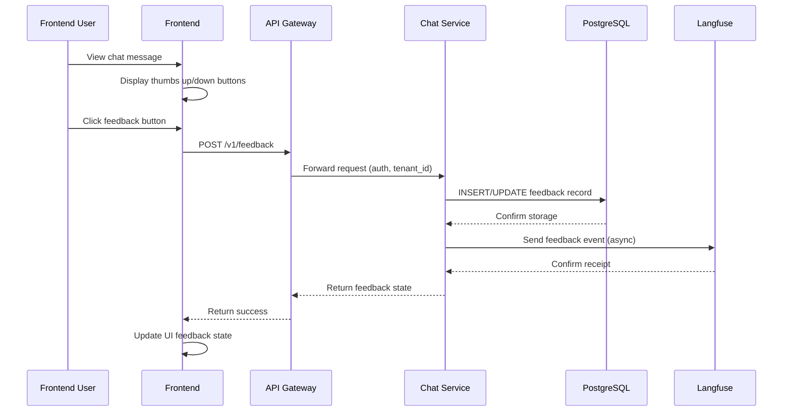
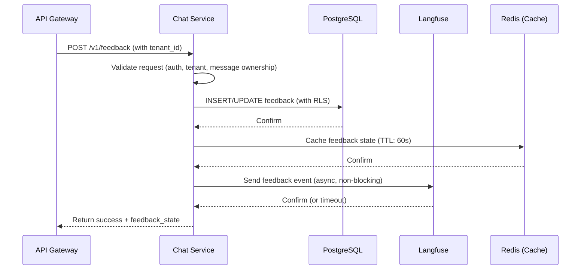
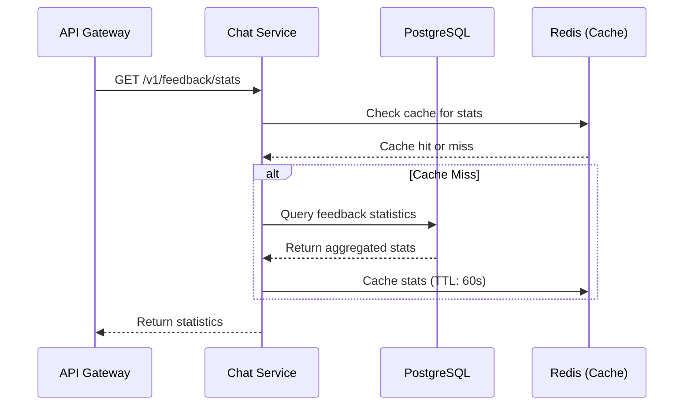

# Design Document: User Feedback Loop

## Overview

This feature adds a user feedback loop (👍/👎) to the Cuckoo-Echo AI chat platform. The feedback loop is the "fuel" for all other improvements including RAG evaluation, Prompt optimization, and model selection. Users can provide feedback on individual chat messages, and this data will be stored for analysis and continuous improvement of the AI system.

**Key Design Decisions:**
- Store feedback in PostgreSQL with Row Level Security (RLS) for multi-tenant isolation
- Use PartitionKey derived from tenant_id for data isolation
- Integrate with Langfuse for correlation with LLM performance metrics
- Add minimal changes to existing codebase (new routes, simple database schema)
- Follow existing patterns (FastAPI, LangGraph, structlog)

## Architecture



## Components and Interfaces

### New Components

1. **Feedback Service** (`chat_service/services/feedback.py`)
   - Store feedback in PostgreSQL
   - Retrieve feedback statistics
   - Send feedback to Langfuse

2. **Feedback Routes** (`chat_service/routes/feedback.py`)
   - POST /v1/feedback - Record feedback
   - GET /v1/feedback/stats - Get feedback statistics

3. **Database Schema** (new table: `feedback`)
   - Stores user feedback with tenant isolation

### Modified Components

1. **Agent State** (`chat_service/agent/state.py`)
   - Add `feedback_state` field to track current feedback

2. **Chat Routes** (`chat_service/routes/chat.py`)
   - Include feedback_state in SSE responses
   - Update thread history to include feedback

## Data Models

### Feedback Record

```python
# Database schema (PostgreSQL)
CREATE TABLE feedback (
    id UUID PRIMARY KEY DEFAULT gen_random_uuid(),
    thread_id UUID NOT NULL,
    message_id UUID NOT NULL,
    user_id UUID NOT NULL,
    tenant_id UUID NOT NULL,
    feedback_type VARCHAR(20) NOT NULL CHECK (feedback_type IN ('thumbs_up', 'thumbs_down')),
    created_at TIMESTAMPTZ NOT NULL DEFAULT NOW(),
    updated_at TIMESTAMPTZ NOT NULL DEFAULT NOW(),
    
    -- Multi-tenant isolation
    partition_key VARCHAR(255) NOT NULL,
    
    -- Langfuse correlation
    langfuse_trace_id UUID,
    langfuse_span_id UUID,
    
    UNIQUE(thread_id, message_id, user_id, tenant_id)
);

-- RLS Policy
CREATE POLICY feedback_tenant_isolation ON feedback
    USING (tenant_id = current_setting('app.current_tenant')::uuid);

-- Indexes for performance
CREATE INDEX idx_feedback_tenant ON feedback (tenant_id);
CREATE INDEX idx_feedback_thread ON feedback (thread_id);
CREATE INDEX idx_feedback_message ON feedback (message_id);
CREATE INDEX idx_feedback_partition ON feedback (partition_key);
```

### Feedback Statistics

```python
# Response model
{
    "total": int,
    "thumbs_up": int,
    "thumbs_down": int,
    "thumbs_up_percentage": float | None,
    "thumbs_down_percentage": float | None
}
```

## API Endpoints

### POST /v1/feedback

Record feedback for a message.

**Request:**
```json
{
    "thread_id": "uuid",
    "message_id": "uuid",
    "feedback_type": "thumbs_up" | "thumbs_down"
}
```

**Response (200 OK):**
```json
{
    "success": true,
    "feedback_state": "thumbs_up" | "thumbs_down" | null
}
```

**Error Responses:**
- 400: Invalid request (missing fields, invalid feedback_type)
- 401: Unauthorized (invalid/missing API key)
- 403: Forbidden (user didn't receive this message)
- 500: Database error

### GET /v1/feedback/stats

Get feedback statistics for a thread or message.

**Query Parameters:**
- `thread_id` (optional): Filter by thread
- `message_id` (optional): Filter by message

**Response (200 OK):**
```json
{
    "total": 10,
    "thumbs_up": 8,
    "thumbs_down": 2,
    "thumbs_up_percentage": 80.0,
    "thumbs_down_percentage": 20.0
}
```

**Error Responses:**
- 400: Invalid request (invalid UUID format)
- 401: Unauthorized (invalid/missing API key)
- 500: Database error

## Data Flow

### Feedback Recording Flow



### Feedback Statistics Flow



## Correctness Properties

### Property 1: Feedback State Consistency

*For any* valid feedback request with thread_id, message_id, user_id, and tenant_id, the system SHALL store exactly one feedback record and return the correct feedback_state.

**Validates: Requirements 1.2, 2.1, 2.4**

### Property 2: Multi-Tenant Isolation

*For any* feedback query, the system SHALL only return feedback records where the tenant_id matches the authenticated user's tenant_id, and no records from other tenants shall be visible.

**Validates: Requirements 3.1, 3.2, 3.3**

### Property 3: Feedback Toggle Idempotence

*For any* user feedback on a message, clicking the same feedback button twice SHALL toggle the feedback off (remove it), and clicking a different feedback button SHALL replace the existing feedback.

**Validates: Requirements 1.4**

### Property 4: Statistics Accuracy

*For any* feedback statistics query, the system SHALL return accurate counts (total, thumbs_up, thumbs_down) and percentages that sum to 100% (when total > 0).

**Validates: Requirements 4.1, 4.4**

### Property 5: Langfuse Event Delivery

*For any* feedback record created, the system SHALL attempt to send a feedback event to Langfuse with all required fields (prompt, response, feedback, metadata), and failures SHALL NOT block the feedback recording.

**Validates: Requirements 5.1, 5.4**

## Error Handling

### Error Categories

1. **Authentication Errors (401)**
   - Invalid or missing API key
   - Inactive tenant

2. **Authorization Errors (403)**
   - User attempts to provide feedback on a message they didn't receive
   - Tenant isolation violation

3. **Validation Errors (400)**
   - Missing required fields (thread_id, message_id, feedback_type)
   - Invalid UUID format
   - Invalid feedback_type value

4. **Database Errors (500)**
   - Connection failures
   - RLS policy violations
   - Unique constraint violations

### Error Response Format

```json
{
    "error": "ERROR_CODE",
    "message": "Human-readable error message",
    "details": {
        "field": "Optional field-specific details"
    }
}
```

## Testing Strategy

### Unit Tests

1. **Feedback Service Tests**
   - Test feedback storage with valid data
   - Test feedback toggle (remove on same click)
   - Test feedback replacement (different feedback)
   - Test multi-tenant isolation
   - Test statistics calculation

2. **Route Tests**
   - Test POST /v1/feedback with valid data
   - Test POST /v1/feedback with invalid data
   - Test GET /v1/feedback/stats with various filters
   - Test authentication and authorization

### Integration Tests

1. **End-to-End Tests**
   - Test complete feedback flow from frontend to database
   - Test Langfuse integration with feedback events
   - Test multi-tenant isolation in real scenario

2. **Performance Tests**
   - Test feedback recording latency (< 100ms P95)
   - Test statistics query latency (< 200ms P95)
   - Test concurrent feedback requests

### Property-Based Tests

**Property 1: Feedback State Consistency**

*For any* valid feedback request with thread_id, message_id, user_id, and tenant_id, the system SHALL store exactly one feedback record and return the correct feedback_state.

**Validates: Requirements 1.2, 2.1, 2.4**

**Property 2: Multi-Tenant Isolation**

*For any* feedback query, the system SHALL only return feedback records where the tenant_id matches the authenticated user's tenant_id, and no records from other tenants shall be visible.

**Validates: Requirements 3.1, 3.2, 3.3**

**Property 3: Feedback Toggle Idempotence**

*For any* user feedback on a message, clicking the same feedback button twice SHALL toggle the feedback off (remove it), and clicking a different feedback button SHALL replace the existing feedback.

**Validates: Requirements 1.4**

**Property 4: Statistics Accuracy**

*For any* feedback statistics query, the system SHALL return accurate counts (total, thumbs_up, thumbs_down) and percentages that sum to 100% (when total > 0).

**Validates: Requirements 4.1, 4.4**

**Property 5: Langfuse Event Delivery**

*For any* feedback record created, the system SHALL attempt to send a feedback event to Langfuse with all required fields (prompt, response, feedback, metadata), and failures SHALL NOT block the feedback recording.

**Validates: Requirements 5.1, 5.4**

### When NOT to Use Property-Based Testing

Property-based testing is NOT appropriate for:
- **Infrastructure and External Services**: Testing Langfuse connectivity, database connections
- **Authentication and Authorization**: Testing API key validation, tenant isolation policies
- **UI Rendering**: Testing frontend button states and visual feedback
- **Performance Testing**: Testing response times and concurrency

Instead, use:
- **Integration Tests**: 1-3 representative examples for Langfuse connectivity
- **Unit Tests**: Specific examples for authentication/authorization
- **Snapshot Tests**: Visual regression tests for UI components
- **Load Tests**: Performance testing with tools like k6 or Locust

## Implementation Notes

1. **Minimal Changes**: Only add new routes and services, don't modify existing chat flow
2. **Async Langfuse Integration**: Send feedback to Langfuse asynchronously to avoid blocking
3. **Caching**: Cache feedback state for 60 seconds to reduce database load
4. **RLS Enforcement**: Use `tenant_db_context` for all feedback operations
5. **PartitionKey**: Derive partition_key from tenant_id for additional isolation layer
6. **Backward Compatibility**: Don't break existing chat endpoints
