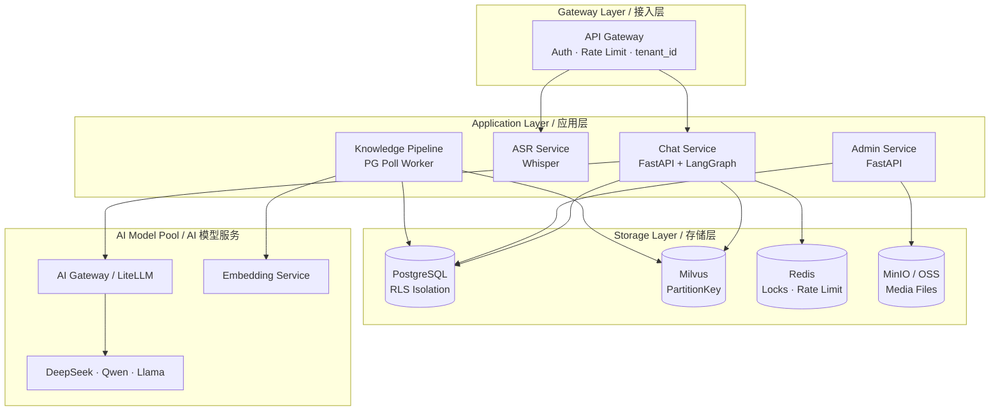

# 🐦 Cuckoo-Echo / 布谷回响

> Enterprise AI Customer Service SaaS Platform — 面向企业的百万日活 AI 智能客服 SaaS 平台

[](https://www.python.org/downloads/)
[](LICENSE)

Cuckoo-Echo is a multi-tenant AI customer service platform powered by LangGraph agent orchestration, RAG knowledge retrieval, and multi-modal input processing. It provides high-concurrency, low-latency intelligent customer service for B2B enterprises.

Cuckoo-Echo（布谷回响）是一个以多租户隔离为核心的 AI 智能客服 SaaS 平台，通过 LangGraph 编排 Agent 工作流，结合 RAG 知识库检索与业务工具调用，为 B 端企业提供高并发、低延迟的智能客服能力。

---

## Architecture / 系统架构



---

## Tech Stack / 技术栈

| Layer | Technology | Purpose |
|-------|-----------|---------|
| API Framework | FastAPI + SSE/WebSocket | Async-native, SSE token streaming |
| ASGI Server | Granian (prod) / uvicorn (dev) | Rust-based, 2-4x throughput vs uvicorn |
| Agent Orchestration | LangGraph StateGraph | HITL breakpoints, checkpointer, conditional routing |
| LLM Gateway | LiteLLM | OpenAI-compatible, multi-model routing |
| Vector DB | Milvus 2.5+ | PartitionKey isolation, built-in BM25 hybrid search |
| Database | PostgreSQL + RLS | Row-level security for multi-tenant isolation |
| Cache / Locks | Redis | Distributed locks, rate limiting |
| Document Parsing | Docling (IBM) | Unified PDF/Word/HTML/TXT parsing |
| Embedding | Sentence-Transformers | Text vectorization |
| Reranker | BGE Reranker v2 | Cross-encoder reranking for RAG |
| Object Storage | MinIO / OSS | Media file storage |
| Observability | Langfuse + Prometheus | LLM tracing, metrics |
| Package Manager | uv | Rust-based, 10-100x faster than pip |

---

## Quick Start / 快速启动

> 📖 详细指南请参考 [docs/quickstart.md](docs/quickstart.md)

### Docker Compose 一键启动（推荐）

```bash
# 1. 配置环境变量
cp .env.example .env.docker
# 编辑 .env.docker 配置 LLM（支持 Ollama 本地模型，见 quickstart 文档）

# 2. 启动全部服务
docker compose up -d

# 3. 访问
#   管理后台: http://localhost/login  (admin@test.com / test123456)
#   C端聊天: http://localhost/chat?api_key=ck_test_integration_key
```

### 本地开发模式

```bash
# 1. Install dependencies / 安装依赖
uv sync
cd frontend && pnpm install

# 2. Start infrastructure / 启动基础设施
docker compose up -d postgres redis milvus minio

# 3. Run database migrations / 执行数据库迁移
make migrate

# 4. Seed test data / 创建测试数据
make seed

# 5. Start backend services / 启动后端（3 个终端）
make dev-all

# 6. Start frontend / 启动前端
cd frontend && pnpm dev
```


---

## API Endpoints / 接口概览

### C-端对话 (Customer-Facing Chat)

| Method | Path | Description |
|--------|------|-------------|
| POST | `/v1/chat/completions` | Chat with SSE streaming / 流式对话 |
| WS | `/v1/chat/ws` | WebSocket chat / WebSocket 对话 |
| POST | `/v1/media/upload` | Upload media (audio/image) / 上传媒体文件 |
| GET | `/v1/threads/{thread_id}` | Get conversation history / 获取会话历史 |

### Admin 管理后台

| Method | Path | Description |
|--------|------|-------------|
| POST | `/admin/v1/knowledge/docs` | Upload knowledge document / 上传知识文档 |
| GET | `/admin/v1/knowledge/docs/{id}` | Get document status / 查询文档状态 |
| DELETE | `/admin/v1/knowledge/docs/{id}` | Delete document / 删除文档 |
| PUT | `/admin/v1/config/persona` | Configure bot persona / 配置机器人人设 |
| POST | `/admin/v1/hitl/{session_id}/take` | Take over conversation / 接管会话 |
| POST | `/admin/v1/hitl/{session_id}/end` | End intervention / 结束介入 |
| GET | `/admin/v1/metrics/overview` | Dashboard metrics / 数据看板 |

> Full API documentation: [docs/api.md](docs/api.md)

---

## Project Structure / 项目结构

```
cuckoo-echo/
├── api_gateway/              # API Gateway — auth, rate limiting, routing
│   ├── main.py               # FastAPI app entry
│   └── middleware/            # Auth, rate limit, circuit breaker, media format
├── chat_service/             # Chat Service — LangGraph agent orchestration
│   ├── main.py               # FastAPI app entry
│   ├── agent/                # LangGraph state graph
│   │   ├── graph.py          # StateGraph definition
│   │   ├── state.py          # AgentState TypedDict
│   │   └── nodes/            # Graph nodes (preprocess, router, rag, tools, llm, guardrails)
│   └── routes/               # HTTP/SSE/WebSocket endpoints
├── admin_service/            # Admin Service — knowledge, HITL, config, metrics
│   ├── main.py
│   └── routes/               # Admin API endpoints
├── knowledge_pipeline/       # Knowledge Pipeline — document processing worker
│   ├── worker.py             # PG poll worker
│   ├── parser.py             # Docling document parser
│   └── chunker.py            # Recursive text chunker
├── asr_service/              # ASR Service — Whisper speech-to-text
├── ai_gateway/               # AI Gateway — LiteLLM multi-model routing
├── shared/                   # Shared utilities
│   ├── config.py             # Pydantic Settings
│   ├── db.py                 # PostgreSQL connection pool + RLS context
│   ├── redis_client.py       # Redis client
│   ├── milvus_client.py      # Milvus client
│   ├── oss_client.py         # MinIO/OSS client
│   ├── embedding_service.py  # Embedding service
│   ├── billing.py            # Token billing
│   ├── metrics.py            # Prometheus metrics
│   └── logging.py            # Structlog configuration
├── migrations/               # SQL migration files
├── tests/                    # Test suite
│   ├── unit/                 # Unit tests
│   ├── pbt/                  # Property-based tests (Hypothesis)
│   ├── integration/          # Integration tests
│   ├── e2e/                  # End-to-end tests
│   └── load/                 # Load tests (Locust)
├── k8s/                      # Kubernetes manifests + Dockerfile
├── docs/                     # Documentation
├── frontend/                 # Frontend — React + TypeScript + Vite
│   ├── src/
│   │   ├── pages/            # Page components (LoginPage, admin/*, chat/*)
│   │   ├── stores/           # Zustand state management
│   │   ├── network/          # Axios, SSE, WebSocket clients + field mapper
│   │   ├── lib/              # Utilities (cache, analytics, error map, etc.)
│   │   ├── components/       # Shared UI components (Toast, Skeleton, etc.)
│   │   ├── hooks/            # Custom React hooks
│   │   └── __tests__/        # Unit tests + PBT (Vitest + fast-check)
│   ├── e2e/                  # Playwright E2E integration tests
│   ├── nginx.conf            # Production Nginx config
│   └── Dockerfile            # Multi-stage build (Node → Nginx)
├── scripts/                  # Utility scripts
│   ├── seed.py               # Idempotent test data seeder
│   ├── ragas_quality_gate.py # RAG quality evaluation
│   └── verify_e2e.sh         # E2E smoke test script
├── docker-compose.yml        # Infrastructure + app services
├── docker-compose.override.yml  # Dev overrides (hot-reload)
├── Makefile                  # Development commands
├── pyproject.toml            # Project config + dependencies
└── .env.example              # Environment variable template
```

---

## Testing / 测试

```bash
# Backend unit tests / 后端单元测试
make test

# Backend property-based tests / 属性测试 (Hypothesis)
make test-pbt

# Backend integration tests (requires Docker) / 集成测试
make test-integration

# Backend E2E tests / 后端端到端测试
make test-e2e

# Frontend unit tests + PBT / 前端单元测试
make test-frontend

# Frontend E2E integration tests (requires Docker Compose running) / 前端 E2E
make test-frontend-e2e

# RAG quality evaluation (Ragas) / RAG 质量评估
make quality-gate

# All backend tests / 全部后端测试
make test-all

# Lint / 代码检查
make lint

# Format / 代码格式化
make format
```

---

## Contributing / 贡献指南

1. Install pre-commit hooks: `make pre-commit`
2. Follow code style: `ruff check` + `ruff format`
3. Write tests for new features (unit + property-based)
4. Keep commits atomic and descriptive

### Code Style

- Linter/Formatter: [Ruff](https://docs.astral.sh/ruff/) (line-length: 120, target: Python 3.11)
- Type hints required for all public functions
- Structured logging via `structlog` (no `print()` or `logging.getLogger()`)

---

## Documentation / 文档

- [Quick Start / 快速启动](docs/quickstart.md)
- [API Reference / 接口文档](docs/api.md)
- [Architecture / 架构设计](docs/architecture.md)
- [Development Guide / 开发指南](docs/development.md)
- [Deployment / 部署指南](docs/deployment.md)
- [Performance Baseline / 性能基线](docs/performance.md)

---

## License

MIT
