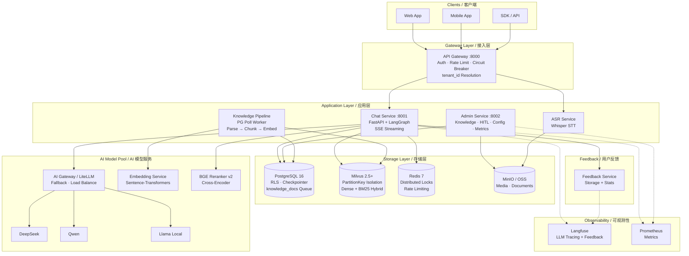
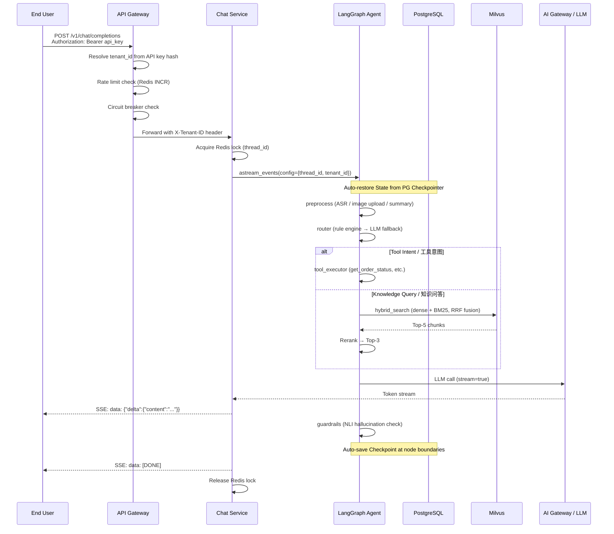
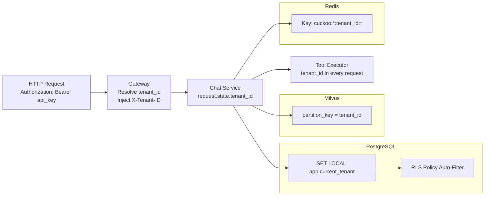
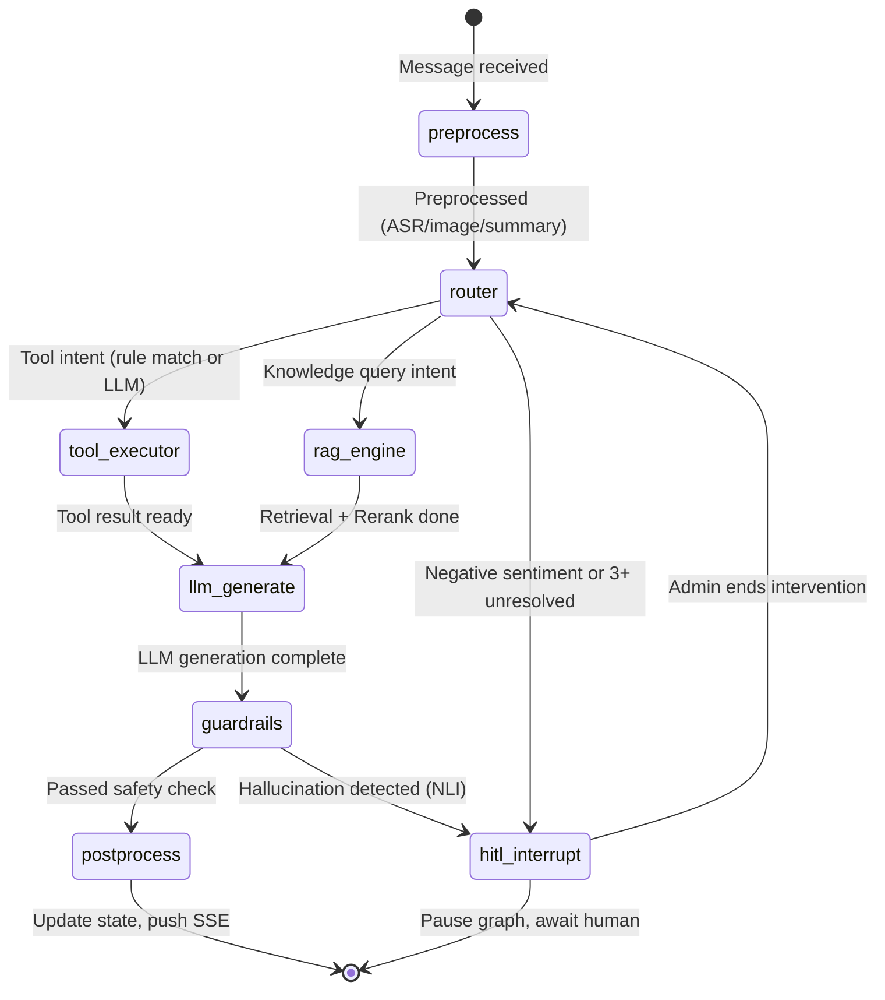
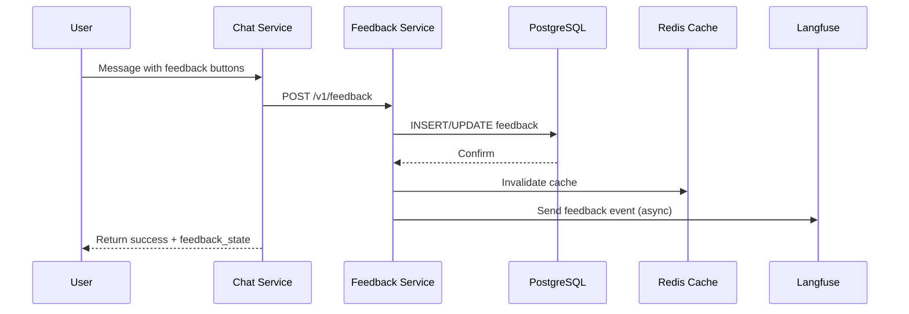
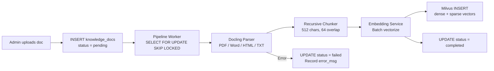

# System Architecture / 系统架构

## Overview / 概述

Cuckoo-Echo follows a microservices architecture with four application services backed by shared infrastructure. Multi-tenant data isolation is enforced at three layers: PostgreSQL RLS, Milvus PartitionKey, and Redis key prefixes.

Cuckoo-Echo 采用微服务架构，四个应用服务共享基础设施层。多租户数据隔离通过三层防御实现：PostgreSQL 行级安全（RLS）、Milvus PartitionKey、Redis Key 前缀。

---

## Overall System Architecture / 系统整体架构



---

## Request Flow / 请求处理流程



---

## Multi-Tenant Data Isolation / 多租户数据隔离



| Layer | Mechanism | Isolation Level |
|-------|-----------|----------------|
| PostgreSQL | RLS (`SET LOCAL app.current_tenant`) | Row-level, automatic |
| Milvus | PartitionKey = tenant_id | Partition-level, physical |
| Redis | Key prefix `cuckoo:{scope}:{tenant_id}:` | Key-level, logical |

---

## LangGraph State Machine / Agent 状态机



**Node Responsibilities:**

| Node | Description |
|------|-------------|
| `preprocess` | ASR transcription, image upload to OSS, summary compression (>50 turns) |
| `router` | Rule engine (regex/keyword) → LLM fallback intent classification |
| `rag_engine` | Milvus hybrid search (dense + BM25) → BGE Reranker → Top-3 |
| `tool_executor` | Business tool calls (order status, address update) with tenant_id |
| `llm_generate` | LLM streaming generation via AI Gateway |
| `guardrails` | NLI hallucination detection (cross-encoder/nli-deberta-v3-small) |
| `postprocess` | Push correction message if needed, update state |

---

## User Feedback Loop / 用户反馈环



**Data Flow:**

1. User clicks 👍/👎 on AI response
2. Frontend calls `POST /v1/feedback` with `feedback_type`
3. Backend stores/updates feedback in PostgreSQL (RLS enforced)
4. Redis cache invalidated (TTL: 60s)
5. Async feedback event sent to Langfuse for tracing

---

## Knowledge Pipeline / 知识处理管道



---

## Deployment Topology / 部署拓扑

### MVP: Single Region

```
┌─────────────────────────────────────────────┐
│  Kubernetes Cluster                         │
│  ┌──────────┐ ┌──────────┐ ┌──────────┐    │
│  │ Gateway  │ │  Chat    │ │  Admin   │    │
│  │ (HPA)   │ │ (HPA)   │ │ (HPA)   │    │
│  └──────────┘ └──────────┘ └──────────┘    │
│  ┌──────────────────┐                       │
│  │ Knowledge Worker │                       │
│  └──────────────────┘                       │
│                                             │
│  ┌────────┐ ┌───────┐ ┌────────┐ ┌──────┐  │
│  │ PG 16  │ │ Redis │ │ Milvus │ │ MinIO│  │
│  └────────┘ └───────┘ └────────┘ └──────┘  │
└─────────────────────────────────────────────┘
```

### Phase 2: Multi-Region (planned)

- GSLB for geo-routing
- PostgreSQL primary (center) + read replicas (edge, <500ms lag)
- Milvus primary (center) + Kafka-synced replicas (edge, <10s lag)
- Independent Redis clusters per region (no cross-region sync)
- 30s failover via GSLB health checks
